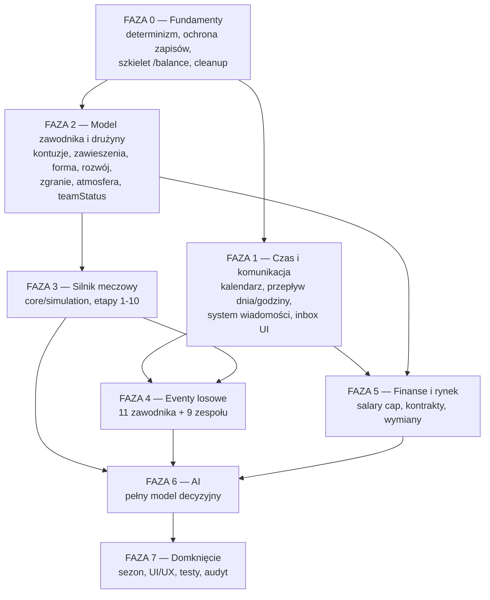

# Plan rozwoju V1 — New Football Manager

Status: **zatwierdzony**
Zakres: doprowadzenie implementacji do pełnej wierności dokumentacji w `/docs`
Liczba zadań: **42** w **8 fazach**

---

## Spis treści

1. [Cel i zakres](#1-cel-i-zakres)
2. [Ustalenia](#2-ustalenia)
3. [Stan obecny](#3-stan-obecny)
4. [Zasada porządkowania](#4-zasada-porządkowania)
5. [Znane sprzeczności w docs](#5-znane-sprzeczności-w-docs)
6. [Plan zadań](#6-plan-zadań)
   - [Faza 0 — Fundamenty](#faza-0--fundamenty)
   - [Faza 1 — Czas i komunikacja](#faza-1--czas-i-komunikacja)
   - [Faza 2 — Model zawodnika i drużyny](#faza-2--model-zawodnika-i-drużyny)
   - [Faza 3 — Silnik meczowy](#faza-3--silnik-meczowy)
   - [Faza 4 — Eventy losowe](#faza-4--eventy-losowe)
   - [Faza 5 — Finanse i rynek](#faza-5--finanse-i-rynek)
   - [Faza 6 — AI](#faza-6--ai)
   - [Faza 7 — Domknięcie](#faza-7--domknięcie)
7. [Podsumowanie i ryzyka](#7-podsumowanie-i-ryzyka)
8. [Kryteria ukończenia V1](#8-kryteria-ukończenia-v1)

---

## 1. Cel i zakres

Kod ma kompletny szkielet: modele w kształcie z docs (freezed + JSON), kalendarz z typowanymi eventami, pipeline offseason od loterii do rolloveru, 34 ekrany, pełne l10n pl/en, autosave po każdej mutacji.

Brakuje logiki, która ten szkielet wypełnia:

- silnik meczowy nie realizuje modelu pojedynków z `matchday_model.md`,
- nie ma statystyk indywidualnych (`playerStats` zawsze puste, posiadanie i strzały fabrykowane z goli),
- AI to 96-linijkowy stub bez inicjowania wymian, rotacji i świadomości formacji,
- brak trybu godzinowego kontraktów (10 h/dzień w tyg. 46–47),
- zgranie i atmosfera istnieją jako pola, ale nie żyją,
- brak 20 eventów losowych i pełnego katalogu ~55 wzorców wiadomości,
- brak pełnych reguł salary cap i wymian (matching, Stepien, NTC, aprony).

Celem planu jest domknięcie wszystkich tych obszarów do pełnej zgodności z dokumentacją.

---

## 2. Ustalenia

| # | Ustalenie |
| - | --------- |
| **1d** | Kolejność optymalizowana pod **łączną ilość pracy i liczbę przeróbek**. Brak deadline'u; szybki widoczny efekt nie jest kryterium. |
| **2b** | Stałe balansu synchronizowane **przy okazji** — każda wartość aktualizowana w zadaniu, które jej używa. Brak jednorazowego commita synchronizacyjnego. |
| **3a** | **Pełna wierność docs**: tryb godzinowy FA, 26 kontuzji, 20 eventów, cały katalog wiadomości, pełne reguły cap/trade/AI. |
| **1a** | Przy każdej napotkanej sprzeczności w docs: **rekomendacja z uzasadnieniem → oczekiwanie na decyzję → poprawka w docs**. |
| **2c** | **Brak migracji zapisów w V1.** `schemaVersion` odrzuca niekompatybilne save'y z jasnym komunikatem. Mechanizm migracji dopiero po 1.0. |
| **3a** | Nowy silnik meczowy w pakiecie **`core/simulation/`**, budowany obok istniejącego; `match_engine.dart` usuwany przy przełączeniu (Task 22). |
| — | `general_rules.md`: wszystkie stałe liczbowe w `/balance`, wszystkie teksty w `app_pl.arb` / `app_en.arb`. |

---

## 3. Stan obecny

### Co działa

| Obszar | Stan |
| ------ | ---- |
| Liga i terminarz | 30 drużyn, 2 konferencje, 58 kolejek double round robin |
| Kalendarz | `CalendarService` + `CalendarEventRegistry` (11 typowanych eventów) |
| Pętla dnia | `DaySimulator.simulateDay` — fazy, kolejki, regeneracja, tygodniowy development |
| Batch symulacja | `GameController._simulateUntil` z 6 stop reasons, anulowanie |
| Offseason | `SeasonService` (878 linii): play-in, playoff, awards, loteria, scout report, combine, mock, draft, FA open, rollover |
| Modele | Wszystkie freezed + JSON; `Contract` ma `noTradeClause`/`hasBirdRights`, `GameMessage` ma `DecisionSpec`/`expiresAt`/`groupKey`/`dedupKey` |
| Tabela siły ligi | `LeagueStrengthService` z histerezą i stałym rozkładem tierów |
| UI | 34 ekrany, shell z 6 zakładkami, go_router, pełne l10n pl/en |
| Persystencja | JSON per save + indeks, `schemaVersion` |

### Główne luki

| # | Luka | Dowód w kodzie |
| - | ---- | -------------- |
| 1 | Silnik meczowy uproszczony | `match_engine.dart` — jedna szansa 8,5%/min z `teamPower`, kartki na płaskim 1,2%, kontuzje 0,4% |
| 2 | Brak statystyk indywidualnych | `LiveMatch.toResult()` — `shots = goals + 4`, `possession: 50`, `playerStats` puste |
| 3 | AI to stub | `team_ai_service.dart` (96 linii) — płaska marża 12%, lineup po surowym OVR |
| 4 | Brak trybu godzinowego | `DaySimulator` nie ma pojęcia godziny |
| 5 | Zgranie/atmosfera martwe | Pola w `Team` bez aktualizacji i bez mnożników |
| 6 | Brak eventów losowych | Zero z 11 eventów zawodnika i 9 zespołu |
| 7 | Wiadomości bez decyzji | Jedno `MessageService.send`, brak eskalacji, digestów, dedup, retencji |
| 8 | Cap i trade bez reguł twardych | Brak matchingu, Stepiena, NTC, agregacji przy apronach |
| 9 | Balans rozjechany | cap 300M (docs 350M), aprony 340/370M (docs 396,7/431,7M), pensje 0,5–80M (docs 1–60M), staff cap 12M (docs 15M) |
| 10 | Brak harnessu kalibracyjnego | Kryteria akceptacji z docs (10k meczów, 10 sezonów) nie są mierzone |
| 11 | Martwy kod | `simple_match_engine.dart` (217 linii), osierocony `tactics_screen.dart` (166 linii) |
| 12 | Zero testów UI | 34 ekrany, 689 linii testów wyłącznie na core |

---

## 4. Zasada porządkowania

Rework powstaje, gdy system A jest budowany przed systemem B, od którego zależy. Cztery takie pułapki wyznaczają kolejność faz.

### 4.1 Determinizm przed wszystkim

`matchday_model.md` §14.1 wymaga `matchSeed = hash(saveSeed, seasonYear, matchId)`.
`AI_behaviour.md` §1.4 wymaga `aiSeed = hash(saveSeed, seasonYear, weekNumber, teamId, decisionType)`.

W kodzie nie ma `saveSeed`, a seed meczu to `Object.hash(home.id, away.id)`. Każdy nowy roll (kontuzje, eventy, decyzje AI) potrzebuje tego kontraktu — retrofit później dotyka każdego miejsca losowania.

### 4.2 Wiadomości przed systemami, które je emitują

Katalog `messages.md` §8 to ~55 wzorców z priorytetami, eskalacją warunkową, decyzjami z `expiresAt`/`defaultOnExpiry`, digestami i deduplikacją. Eventy zespołu, eventy zawodnika, kontrakty, wymiany i draft są **wszystkie** w tym katalogu jako wiadomości decyzyjne. Zbudowanie ich przed infrastrukturą decyzji oznacza przepisanie każdego z nich.

### 4.3 Tryb godzinowy przed kontraktami

`contracts.md` §3 i `messages.md` §2 opisują 10 godzin/dzień w tyg. 46 (wt–niedz) i 47. Reakcja `waiting` jest zdefiniowana w godzinach, okno finalizacji `Accept` to 3 h. Cała maszyna negocjacji jest funkcją zegara godzinowego.

### 4.4 Model zawodnika i wskaźniki drużyny przed silnikiem

Pipeline `effAttr` (§5.1) mnoży `chemistryMult` × `cohesionMult` × `atmosphereMult` × `formMult` × `staminaMult` × `contextMult` × `leaderMult`. Efekty pomeczowe (§16) zapisują kontuzje z katalogu, inkrementują liczniki zawieszeń, aktualizują formę z ratingu i doliczają `growthRate` z minut. Silnik pisany wcześniej produkuje zaślepki w ośmiu miejscach.

### 4.5 Konsekwencja: AI na końcu

Symetria z `AI_behaviour.md` §1.1 („AI podlega dokładnie tym samym regułom co gracz") czyni AI warstwą decyzyjną nad gotowymi silnikami. Pisanie jej wcześniej wymusza podwójną implementację reguł.

### 4.6 Graf zależności

---

## 5. Znane sprzeczności w docs

Tryb **1a**: każda pozycja dostaje osobne pytanie w momencie, gdy zablokuje zadanie. Poniżej rekomendacje, żeby można je było rozstrzygnąć wcześniej.

| # | Rozbieżność | Blokuje | Rekomendacja | Status |
| - | ----------- | ------- | ------------ | ------ |
| 1 | Tyg. 44: tabela „Exact schedule" mówi Awards pon / StaffGrowth wt; checklist „Kluczowe eventy" mówi StaffGrowth pon / Awards wt | Task 5 | **Rozstrzygnięto: Awards pon, StaffGrowth/retire wt, Retirements śr, Lottery pt.** Tabela „Exact schedule" jest kanoniczna; okno wymian otwiera się w pon tyg. 44 niezależnie od Awards. | ✅ |
| 2 | Przeliczanie tabeli siły ligi: `team_management.md` „co miesiąc 1. dnia miesiąca + pon tyg. 23 + start kariery"; `AI_behaviour.md` §2.1 „wtorek tyg. 44 i poniedziałek tyg. 23" | Task 14 | Kanonem `team_management.md`. Gra liczy tygodnie, nie miesiące → **co 4 tygodnie (tyg. 1, 5, 9, 13, 17, 21) + pon tyg. 23 + wt tyg. 44 + start kariery**. Wtorek tyg. 44 dochodzi, bo AI potrzebuje świeżej wyceny przed loterią. | ✅ |
| 3 | Progi `playerOfferScore`: pasmo 40–59 „Counter" nachodzi na 55–69 „Waiting/Counter/Accept" | Task 28 | **40–54 Counter, 55–69 pasmo mieszane** z losowaniem z docs (50/50 w punkcie 62, ±6 pkt rozkładu na punkt odchylenia). | ⏳ |
| 4 | Rookie scale: `contracts.md` §8 `baseScale / (1 + pickSlot × 0,06)`; kod `rookiePickDecay = 0,08` | Task 27 | **0,06** za docs; kod zsynchronizować. | ⏳ |
| 5 | `publicCriticism` → „Kara dyscyplinarna: −2 atmosfera, −2 atmosfera" (duplikat) | Task 26 | **−2 atmosfera, −2 zgranie** — przez analogię do pozostałych opcji eventu. | ⏳ |
| 6 | `messages.md` §13 wymienia `ovrDigest`, §9 definiuje `groupKey = ovr:own:{week}` bez odpowiadającego `type` | Task 7 | Dodać wzorzec **`ovrDigest`** do katalogu (domain `playerEvent`, `silenced`). | ✅ |
| 7 | Literówki formatowania: „zaokrąglane do 2 miejsc po przecinku.0" oraz zdublowana kolumna w tabeli skutków atmosfery (`team_management.md`) | Task 14 | Poprawka kosmetyczna w docs. | ✅ |
| 8 | `game_rules.md`: cap „uzgadniany co 5–7 lat przy nowej umowie TV" — mechanizm nieopisany w szczegółach | Task 27 | Doczytać `salary_cap.md`; jeśli brak reguły, zaproponować: zmiana +4…+12% w losowym roku z przedziału 5–7 lat, termin znany przy podpisaniu. | ⏳ |

---

## 6. Plan zadań

Legenda: `⬜` do zrobienia · `🔄` w trakcie · `✅` gotowe

---

## Faza 0 — Fundamenty

> Tanie zadania, które odblokowują wszystkie pozostałe. Bez nich każda dalsza praca generuje retrofit.

### ✅ Task 1: Deterministyczne ziarno gry i kontrakty seedowania

**Cel:** spełnić wymóg powtarzalności z `matchday_model.md` §14.1 i `AI_behaviour.md` §1.4.

- [x] Dodać `saveSeed` (int) do `GameSave`, ustawiane w `GameFactory.create` z `NewGameRequest.seed`
- [x] Utworzyć `lib/core/random/seeds.dart`
- [x] Zaimplementować `matchSeed(saveSeed, seasonYear, matchId)`
- [x] Zaimplementować `aiSeed(saveSeed, seasonYear, week, teamId, decisionType)`
- [x] Dodać enum `DecisionType` (lineup, formation, tactics, subs, tradeEval, tradeInit, faOffer, extension, draftPick, scoutAssign, eventResolve, rosterFix)
- [x] Przepiąć `MatchEngine.start` na `matchSeed` (usunąć `Object.hash(home.id, away.id)`)
- [x] Przepiąć `GameController._autoSimulatePlayerMatch` na `matchSeed`
- [x] Podnieść `currentSchemaVersion` (zmiana modelu `GameSave`)

**Testy**
- [x] Ten sam `saveSeed` + ten sam stan → identyczny wynik meczu
- [x] Mecz obserwowany i przesymulowany dają ten sam wynik (§17)
- [x] `aiSeed` różni się per `decisionType` przy identycznych pozostałych argumentach

**Demo:** ✅ dwa uruchomienia tej samej kolejki z tego samego save'a dają bit-w-bit identyczne wyniki.

---

### ✅ Task 2: Ochrona przed niekompatybilnymi zapisami (bez migracji)

**Cel:** realizacja decyzji 2c — brak migracji, ale bez crashy i bez cichej utraty danych.

- [x] `SaveRepository.load()` odrzuca `schemaVersion != currentSchemaVersion`
- [x] Rozróżnić komunikat „zapis starszy" i „zapis nowszy" (klucze w `.arb`)
- [x] `listSaves()` nie wywala się na niekompatybilnym wpisie — zwraca metę z wyliczaną kompatybilnością
- [x] Dodać `GameSaveMeta.schemaVersion` do indeksu, żeby lista nie musiała czytać całych plików
- [x] `LoadGameScreen`: niekompatybilne pozycje nieaktywne, z powodem i przyciskiem usunięcia
- [x] Udokumentować w pliku dyscyplinę: każde zadanie zmieniające model podnosi `currentSchemaVersion`

**Dyscyplina wersjonowania:** każda zmiana modelu zapisywanego w JSON musi podnieść `SaveSchema.currentVersion` (alias `SaveRepository.currentSchemaVersion` pozostaje stabilny dla wywołań). W V1 nie dodajemy migracji — starsze i nowsze zapisy pozostają widoczne w indeksie, ale ich ładowanie jest odrzucane z kierunkowym komunikatem.

**Testy**
- [x] Zapis z niższą wersją odrzucony z komunikatem „starszy"
- [x] Zapis z wyższą wersją odrzucony z komunikatem „nowszy"
- [x] Lista zapisów z niekompatybilnymi wpisami zachowuje je w indeksie i wylicza kierunek niezgodności

**Demo:** po podniesieniu schematu stary save widnieje na liście jako niekompatybilny z jasnym powodem, zamiast crashować.

---

### ✅ Task 3: Szkielet brakujących plików balansu

**Cel:** `general_rules.md` — wszystkie stałe w `/balance`; utworzyć raz, żeby kolejne zadania nie tworzyły plików ad hoc.

- [x] `lib/core/balance/matchday_balance.dart` — 28 stałych z `matchday_model.md` §19
- [x] `lib/core/balance/ai_balance.dart` — 40 stałych z `AI_behaviour.md` §12
- [x] `lib/core/balance/messages_balance.dart` — 11 stałych z `messages.md` §15
- [x] `lib/core/balance/events_balance.dart` — progi i szanse rolli z `team_management.md` i `player_management.md`
- [x] Podpiąć wszystkie cztery sekcje do `BalanceConfig` i `BalanceConfig.defaults`
- [x] Wartości wypełniać wg polityki 2b — w zadaniu konsumującym; tu tylko sygnatury i wartości z docs tam, gdzie są jednoznaczne

**Testy**
- [x] `BalanceConfig.defaults` eksponuje wszystkie cztery nowe sekcje
- [x] Sanity check zakresów (prawdopodobieństwa 0–1, mnożniki > 0)

**Demo:** pełna lista stałych z docs jest adresowalna z kodu.

---

### ✅ Task 4: Usunięcie martwego kodu przed przebudową silnika

**Cel:** nie utrzymywać trzech silników i osieroconych ekranów w trakcie Fazy 3.

- [x] Usunąć `lib/core/engine/simple_match_engine.dart` (217 linii, nieużywany)
- [x] Usunąć eksport `SimpleMatchEngine` z `lib/core/core.dart`
- [x] Usunąć osierocony `lib/app/screens/tactics_screen.dart` (166 linii, brak importów)
- [x] Podmienić literał `'Wybierz zmiennika'` w `substitute_sheet.dart:68` na klucz `substitute_sheetTitle`
- [x] Podmienić literał `'Brak dostępnych zawodników do zmiany'` w `substitute_sheet.dart:75` na klucz `substitute_sheetEmpty` oraz użyć `substitute_sheetSubtitle` jako instrukcji
- [x] Uzupełnić TODO w `trade_value_balance.dart:115` tymczasowym `projectedFinish` z opcjonalnym `expectedRank` + notatka, że pełna wersja przychodzi w Task 32
- [x] Usunąć zakomentowany test `simulateUntilNextMatch` w `game_controller_simulate_until_test.dart:43-49`, ponieważ kontroler nie udostępnia tej metody

**Testy**
- [x] `flutter analyze` bez błędów (pozostają istniejące komunikaty informacyjne w innych plikach)
- [x] Wszystkie istniejące testy przechodzą

**Demo:** brak nieosiągalnych ekranów i literałów tekstowych w widgetach taktyki.

---

## Faza 1 — Czas i komunikacja

> Kręgosłup pętli gry. Wszystko, co dzieje się „w czasie" i wszystko, co komunikuje się z graczem, opiera się na tej fazie.

### ✅ Task 5: Kalendarz zgodny z `game_calendar.md`

**Cel:** kanoniczna oś czasu; wszystkie eventy pod właściwymi numerami tygodni i dniami.

- [x] **Rozstrzygnąć sprzeczność #1** — Awards poniedziałek, StaffGrowth/retire wtorek tyg. 44
- [x] `CalendarBalance`: tyg. 1–29 regular, 30 przerwa, 31 play-in, 32–34/35–37/38–40/41–43 playoff, 44+ offseason
- [x] `CalendarService.phaseForWeek` zgodne z pełną mapą tygodni z docs
- [x] Play-in: śr ×2 sloty + sob tyg. 31, z datowanym stanem pośrednim
- [x] Playoff BO5 z formatem 1-2-2, 2 sloty/tydzień, serie w 2–3 tygodniach
- [x] Eventy tyg. 44: Awards (pon), StaffGrowth/retire (wt), Retirements (śr), Lottery (pt)
- [x] Eventy tyg. 45: Scout Report (pon), Combine (śr), Mock finalny (pt)
- [x] Tyg. 46: Draft (pon), generacja klasy N+1 + mock wstępny, extensions (wt–niedz)
- [x] Tyg. 47: FA phase I; okno FA i przygotowania obejmują dalszą część cyklu
- [x] Trade deadline: pon tyg. 23; okno wymian od pon tyg. 44
- [x] Rozszerzyć `CalendarEventRegistry` o **okna** (zakres dni), nie tylko punktowe eventy
- [x] Dodać `CalendarEventId.tradeWindowOpen`
- [x] `SeasonPhase.preseason` jako faza techniczna — nic się nie dzieje

**Testy**
- [x] Pełny cykl tyg. 1 → tyg. 1 trafia w każdy event dokładnie raz
- [x] `nextEvent` poprawnie zawija rok
- [x] `isTradeDeadline`, `isRegularSeasonWeek`, `endOfPhase` zgodne z tabelą docs
- [x] Play-in datowany: mecze środowe i sobotni mecz decydujący

**Demo:** symulacja całego roku loguje eventy w dniach zgodnych z tabelą „Kluczowe eventy”.

---

### ✅ Task 6: Przepływ dnia i tryb godzinowy

**Cel:** `messages.md` §2–3 — wiadomości na start dnia, event/mecz na koniec dnia, 10 h/dzień w oknach kontraktowych.

- [x] Wiadomości dostarczane **całym pakietem na start dnia**, przed jakąkolwiek akcją gracza
- [x] Event / mecz wykonywany **na koniec dnia**, po kliknięciu „Symuluj"
- [x] Gdy w jednym dniu event i mecz: **event przed meczem** (`nextEvent` + ścieżka event → `advanceOneDay`)
- [x] Wiadomości wynikające z meczu (`injury`, `matchResult`) trafiają do **następnego dnia**
- [x] Pauza przy nieodczytanej wiadomości `urgent` — blokada „Symuluj"
- [x] Dodać `currentHour` do `LeagueState` (null poza trybem godzinowym)
- [x] Tryb godzinowy aktywny wyłącznie: tyg. 46 wt–niedz oraz tyg. 47 pon–niedz
- [x] `GameController.advanceOneHour()` jako nowy primitive
- [x] 10 godzin = 1 dzień kalendarzowy; niezużyta godzina przepada
- [x] `simulateToEvent` rozgałęzia się na tryb dzienny i godzinowy
- [x] `HomeScreen`: przycisk zmienia się na „Symuluj godzinę" z licznikiem `h/10`
- [x] Podnieść `currentSchemaVersion` do 3

**Testy**
- [x] Dzień z eventem i meczem wykonuje je w kolejności event → mecz przez istniejący tie-break i pipeline kontrolera
- [x] 10 kliknięć godziny przechodzi do następnego dnia
- [x] Niezużyta godzina nie przenosi slotu oferty
- [x] Nieodczytany `urgent` blokuje przejście dnia i godziny
- [x] `currentHour` przechodzi round-trip przez zapis i znika poza oknem godzinowym

**Demo:** w tyg. 47 przycisk pokazuje licznik 1/10, a mecze i eventy dzieją się na koniec dnia.

---

### ✅ Task 7: Model danych i silnik systemu wiadomości

**Cel:** infrastruktura, na której oprą się wszystkie późniejsze eventy, negocjacje i wymiany.

- [x] **Rozstrzygnąć sprzeczność #6** (`ovrDigest`)
- [x] `MessageCatalog` jako dane: type × kind → domain, defaultPriority, escalateIf, klucze, payload, actions, decision, groupKey, dedupKey
- [x] Pokryć grupę A — Matchday (7 wzorców)
- [x] Pokryć grupę B — Zdrowie (4 wzorce)
- [x] Pokryć grupę C — `playerEvent` (11 kinds)
- [x] Pokryć grupę D — `teamEvent` (9 kinds)
- [x] Pokryć grupę E — Roster (4 wzorce)
- [x] Pokryć grupę F — Kontrakty (10 wzorców)
- [x] Pokryć grupę G — Sztab (5 wzorców)
- [x] Pokryć grupę H — Wymiany (8 wzorców)
- [x] Pokryć grupę I — Draft i skauting (11 wzorców)
- [x] Pokryć grupę J — Finanse (3 wzorce)
- [x] Pokryć grupę K — Sezon i nagrody (6 wzorców)
- [x] Pokryć grupę L — System (2 wzorce) + `ovrDigest`
- [x] Eskalacja warunkowa (§5): 6 predykatów (zawodnik w XI, kontuzja Major, własny klub, podmiot z ligi, payroll > 2. apron, brak GK)
- [x] Rozstrzyganie decyzji po `expiresAt` przez `defaultOnExpiry`
- [x] Digesty przy `DIGEST_MIN_ITEMS = 3` — 5 kubełków z §9
- [x] Digesty nie obejmują `urgent`
- [x] Deduplikacja przez `dedupKey`
- [x] Retencja 2 sezonów w inboksie + archiwum bez limitu
- [x] `MAX_UNREAD_INBOX = 50` z auto-read najstarszych
- [x] `silenced` trafia wyłącznie do archiwum
- [x] Respektowanie `MessageSettings` per type i per domain
- [x] Zakaz wyciszania wiadomości decyzyjnych
- [x] Degradacja wiadomości z `payload` wskazującym na nieistniejący byt (usunięte CTA)

**Testy**
- [x] Przeterminowana decyzja wykonuje `defaultOnExpiry`
- [x] 3 wiadomości tego samego `groupKey` zwijają się w digest
- [x] `urgent` nigdy nie wchodzi do digestu
- [x] `dedupKey` blokuje duplikat tej samej kontuzji
- [x] Wyciszony typ nie pojawia się w inboksie, tylko w archiwum
- [x] Próba wyciszenia typu decyzyjnego jest odrzucana

**Demo:** symulacja tygodnia produkuje inbox z digestami i automatycznie rozstrzygniętą przeterminowaną decyzją.

---

### ✅ Task 8: Klucze l10n dla katalogu wiadomości

**Cel:** kryterium §16 — zero literałów tekstowych poza `.arb`, 100% pokrycia.

- [x] Konwencja `msg_<type>_title` / `msg_<type>_body`
- [x] Konwencja `msg_<type>_<kind>_title` / `_body`
- [x] Konwencja `msg_<type>_action_<slug>`
- [x] Konwencja `msg_<type>_digest_title` / `_digest_body`
- [x] Placeholdery ICU MessageFormat: `{playerName}`, `{days}`, `{salary, number, currency}`, `{position}`, `{teamName}`, `{week}`, `{count}`
- [x] Wypełnić `app_pl.arb` dla wszystkich wzorców
- [x] Wypełnić `app_en.arb` dla wszystkich wzorców
- [x] Regenerować `lib/l10n/generated`

**Testy**
- [x] Każdy wzorzec z `MessageCatalog` ma istniejące klucze tytułu i treści w obu językach
- [x] Każda akcja z `actions` ma klucz etykiety w obu językach
- [x] Każdy `groupKey` ma parę kluczy digestu

**Demo:** test pokrycia przechodzi dla wszystkich wzorców w dwóch językach.

---

### ✅ Task 9: Przebudowa `InboxScreen`, ustawienia powiadomień, archiwum

**Cel:** UX z `messages.md` §14 — inbox jako jedyne źródło informacji.

- [x] Filtry po `MessageDomain`
- [x] Przypięte `urgent` na górze, z czerwoną flagą
- [x] Blokada przycisku „Symuluj" do acknowledge wszystkich `urgent`
- [x] Widok szczegółowy wiadomości: treść, termin, CTA nawigacyjne
- [x] Widok szczegółowy decyzji: opcje, termin, konsekwencja domyślna
- [x] Sekcja „Przeczytane" oddzielona od nieprzeczytanych
- [x] Zakładka archiwum (z `silenced` i wiadomościami starszymi niż 2 sezony)
- [x] Ekran ustawień powiadomień: per `type` i grupowo per `domain` (Ważne / Normalne / Wyciszone / Auto)
- [x] Blokada wyciszania typów decyzyjnych w UI
- [x] Badge z liczbą nieprzeczytanych w shellu

**Testy widgetów**
- [x] Nieodczytany `urgent` blokuje symulację
- [x] Wybór opcji decyzji zmienia stan gry
- [x] Wyciszony typ nie pojawia się w inboksie
- [x] Digest rozwija się do listy składowych

**Demo:** gracz wycisza kategorię, podnosi inną do `urgent`, rozstrzyga decyzję z inboxa i widzi efekt w stanie gry.

---

## Faza 2 — Model zawodnika i drużyny

> Dane, na których stoi silnik meczowy. Bez nich pipeline `effAttr` i efekty pomeczowe wymagają zaślepek.

### ✅ Task 10: Katalog kontuzji

**Cel:** `player_management.md` — 26 urazów w 5 grupach anatomicznych z rozkładem prawdopodobieństwa.

- [x] `InjuryCatalog` w `/balance` z 26 wpisami
- [x] Grupa: głowa i twarz (6 urazów)
- [x] Grupa: ramiona i klatka piersiowa (5 urazów)
- [x] Grupa: mięśnie nóg (6 urazów)
- [x] Grupa: stawy — kolana (4 urazy)
- [x] Grupa: stawy — kostki i stopy (5 urazów)
- [x] Każdy wpis: `id`, `group`, `type` (Minor/Major), zakres dni, waga prawdopodobieństwa
- [x] Zamienić `PlayerState.injuryType` na model `Injury{id, group, type, daysTotal, daysRemaining}`
- [x] Losowanie typu z wag rozkładu
- [x] Czas trwania × `doctorCareMult` ze sztabu
- [x] Major → 10% szans na −0,5★ potencjału, clamp dolny 0,5★
- [x] Minor nie obniża potencjału
- [x] `growthRate` clampowany do `(min, 0)` na czas kontuzji
- [x] Zawodnik kontuzjowany nie wchodzi do protokołu meczowego
- [x] Wiadomości `injury` (eskalacja: XI lub Major), `injuryReturn`, `potentialLoss`
- [x] `dedupKey = injury:{playerId}:{injuryId}`
- [x] Podnieść `currentSchemaVersion`

**Testy**
- [x] Rozkład 100 000 rolli mieści się w wagach z docs (±0,3 pp)
- [x] Major obniża potencjał w ~10% przypadków
- [x] Kontuzja blokuje wzrost OVR, ale nie blokuje spadku przy ujemnym `growthRate`
- [x] Czas trwania mieści się w zakresie dla danego urazu

**Demo:** profil zawodnika pokazuje nazwaną kontuzję z grupą anatomiczną i przewidywaną datą powrotu.

---

### ✅ Task 11: Zawieszenia

**Cel:** `matchday_model.md` §8.4 + `squad_management.md`.

- [x] Licznik żółtych kartek per sezon regularny w stanie zawodnika
- [x] Osobny licznik żółtych dla playoff
- [x] Próg 5 żółtych w sezonie regularnym → 1 mecz pauzy, reset licznika
- [x] Próg 3 żółtych w playoff → 1 mecz pauzy
- [x] Czerwona za drugą żółtą → 1 mecz
- [x] Czerwona bezpośrednia → 1–3 mecze ważone ciężkością
- [x] Pole `suspensionGamesRemaining` w stanie zawodnika
- [x] Zawieszony nie wchodzi do protokołu 18-osobowego
- [x] Dekrementacja po każdym meczu drużyny
- [x] Wiadomości `suspensionStart` (eskalacja dla XI) i `suspensionEnd` (`silenced`)
- [x] Podnieść `currentSchemaVersion` do 6

**Testy**
- [x] 5. żółta nakłada pauzę i resetuje licznik
- [x] Zawieszony odfiltrowany z listy dostępnych do składu
- [x] Licznik playoff niezależny od licznika sezonu regularnego
- [x] Pauza dekrementuje się tylko po meczach własnej drużyny

**Demo:** po 5. żółtej zawodnik znika z dostępnych na kolejny mecz i wraca po odbyciu pauzy, z parą wiadomości w inboksie.

---

### ✅ Task 12: Forma i stamina zgodne z tabelami

**Cel:** `player_management.md` — dokładne tabele zużycia, regeneracji, progów.

- [x] Zużycie staminy per grupa pozycji: 9 grup, 0,16–0,94 / minutę
- [x] Mnożniki zużycia: `Tempo.fast` ×1,15, `Tempo.slow` ×0,90
- [x] Mnożniki: pressing `high` ×1,10, `gegenpressing` ×1,20, `low` ×0,90
- [x] Mnożniki: pogoda `heat` ×1,15, derby ×1,05
- [x] Zużycie proporcjonalne do rozegranych minut
- [x] Regeneracja 20 / dzień
- [x] Regeneracja 20 natychmiast po meczu
- [x] Clamp `stamina ∈ [0, 100]`
- [x] `performanceMult` z progów: 1,00 / 0,97 / 0,90 / 0,75 / 0,50
- [x] `injuryRiskMult` z progów: 0,90 / 1,00 / 1,20 / 1,40 / 1,67
- [x] `formMult` z tabeli 1–10: 0,90 … 1,12
- [x] Aktualizacja formy z ratingu (§16.1): ≥8,5 → +2, 7,5–8,4 → +1, 6,0–7,4 → 0, 4,5–5,9 → −1, <4,5 → −2
- [x] `temperamental` po porażce ×1,5 na ujemnej delcie
- [x] Brak występu (0 min) → drift −0,2 w stronę 6
- [x] Clamp `form ∈ [1, 10]`

**Testy**
- [x] Zawodnik po dwóch meczach w tygodniu ma niższą staminę niż po jednym
- [x] 85 OVR przy formie 2 i staminie 30 działa jak ~59 OVR (§5.2)
- [x] Zużycie GK jest ~4,5× niższe niż wahadłowego
- [x] Forma dryfuje w stronę 6 przy braku występów

**Demo:** UI składu pokazuje staminę z mnożnikiem wydajności i kierunek formy, co czyni rotację czytelną decyzją.

**Implementacja:** `PlayerState.form` zapisuje wartości ułamkowe (schema `8`), a `MatchResult` przechowuje kontekst pogody/derbów i taktyki obu stron, aby post-meczowe zużycie było odtwarzalne.

---

### ✅ Task 13: Pełny model rozwoju

**Cel:** `player_management.md` — `growthRate` z wszystkich czynników × `constDev` 3,67.

- [x] Bazowy `growthRate` z `determination` (tabela 0,50–1,50)
- [x] Czynnik formy: forma 8–10 → +0,05…+0,15, forma 1–3 → −0,15…−0,05
- [x] Czynnik sztabu: Head Coach / Youth Coach Development ★ oraz Mentoring
- [x] Czynnik atmosfery: −0,10…+0,10
- [x] Czynnik minut: +0,01 za każdą rozegraną minutę w tym tygodniu
- [x] Dodatek wiekowy z tabeli 18–40 (od +0,40 do −3,00)
- [x] Bonus osobowości `ambitious` +10%
- [x] Clamp `growthRate ∈ [−3,0; 3,0]`
- [x] Tygodniowy postęp = `growthRate × 3,67` dodawany do `overallProgress` jako punkty procentowe
- [x] Przelew ponad 100% → +1 do wszystkich 6 atrybutów, `overallProgress = 0`, overflow tracony
- [x] Spadek poniżej 0% → −1 do wszystkich atrybutów, `overallProgress = 99`
- [x] Fazy wiekowe (≤26 / 27–32 / ≥33) realizowane wyłącznie przez `growthRate`
- [x] `DevelopmentOutcome` jako trwały realny sufit: Exceed 80%/20% na +0,5/+1,0★, Under 60%/40% na −0,5/−1,0★
- [x] Digest `ovr:own:{week}` przy ≥3 zmianach OVR w tygodniu
- [x] Aktualizacja `pointValue` po każdej zmianie atrybutów
- [x] Licznik minut tygodniowych i raport ostatniego ticku są serializowane; schema zapisu podniesiona do `8`

**Implementacja:** `DevelopmentService` zwraca raport zmian, `DaySimulator` agreguje minuty po meczach i wykonuje tick na granicy tygodnia, a istniejący `Inbox` składa wiadomości OVR własnego klubu w digest. `DevelopmentScreen` pokazuje postęp, deltę i kierunek oraz tygodniową zmianę OVR.

**Testy**
- [x] 18-latek z `determination` 9 i pełnymi minutami rośnie szybciej niż 30-latek
- [x] 35-latek z ujemnym `growthRate` traci OVR
- [x] Overflow ponad 100% jest tracony (nie kumuluje się do +2 OVR)
- [x] Spadek poniżej 0% ustawia `overallProgress` na 99
- [x] Tabele bilansu, injury clamp, outcome, serializacja, minuty i digest OVR

**Demo:** `DevelopmentScreen` pokazuje tygodniowe delty, `overallProgress` i przewidywany kierunek per zawodnik.

---

### ✅ Task 14: Zgranie, atmosfera i tabela siły ligi

**Cel:** `team_management.md` — dwa żyjące wskaźniki z mnożnikami meczowymi.

- [x] **Rozstrzygnięto sprzeczność #2** (moment przeliczania tabeli siły): co 4 tygodnie (tyg. 1, 5, 9, 13, 17, 21), poniedziałek tyg. 23, wtorek tyg. 44 oraz start kariery
- [x] **Rozstrzygnięto sprzeczność #7** (literówki w docs)
- [x] Zgranie: XI w 11/11 optymalnych pozycjach → +0,3 / mecz
- [x] Zgranie: zawodnik poza optymalną pozycją → −0,4 / mecz za zawodnika
- [x] Zgranie: nowy transfer w XI → −1 / mecz, zanik liniowy do 0 po 5. meczu
- [x] Zgranie: `seasonsWithTeam ≥ 3` u ≥10 zawodników → +0,3 / mecz
- [x] Zgranie: klaster ≥4 tej samej narodowości w XI → +0,2 / mecz, max +1,0
- [x] Zgranie: dryf z poziomu atmosfery (−2 / −1 / 0 / +1 / +2 na tydzień)
- [x] `chemistryMult` z progów: 0,95 / 0,98 / 1,00 / 1,02 / 1,05
- [x] Clamp `chemistry ∈ [0, 100]`
- [x] Atmosfera: aktualizacja raz na tydzień (niedziela → poniedziałek)
- [x] Atmosfera: seria 3+ zwycięstw +3, seria 3+ porażek −3
- [x] Atmosfera: wynik tygodnia vs `expectedRank` — progi ±1 / ±2
- [x] Atmosfera: walkower −15 jednorazowo
- [x] Atmosfera: mistrzostwo +30 jednorazowo
- [x] Atmosfera: brak awansu do playoff −8 / −12 / −15 wg `teamStatus`
- [x] `atmosphereMult` z progów: 0,95 / 0,97 / 1,00 / 1,02 / 1,04
- [x] Wpływ atmosfery na szansę eventów: +25% / +10% negatywnych, +10% / +20% pozytywnych
- [x] Clamp `atmosphere ∈ [0, 100]`
- [x] Forma zespołu z ostatnich 8 meczów
- [x] `expectedWins = round(58 × (1 − (expectedRank − 1) / 29 × 0,45) × 0,5)`
- [x] Poprawić moment przeliczania tabeli siły wg rozstrzygnięcia #2
- [x] Tie-break tabeli siły: pełna precyzja `teamPower` → punkty poprzedniego sezonu → niższy payroll → `teamId`
- [x] Roster <15: brakujące miejsca liczone jako 50 OVR
- [x] Niepodpisani draftowani nie wchodzą do `teamPower`
- [x] Wiadomości `atmosphereShift`, `teamStatusChange`
- [x] Podnieść `currentSchemaVersion`

**Testy**
- [x] Histereza: max 1 tier na przeliczenie
- [x] Rozkład tierów zawsze 3/6/9/7/5
- [x] Tie-break rozstrzyga deterministycznie
- [x] Zgranie rośnie wolniej niż atmosfera przy tych samych bodźcach

**Demo:** ekran drużyny pokazuje zgranie i atmosferę z aktualnymi mnożnikami oraz historią zmian tygodniowych.

---

## Faza 3 — Silnik meczowy

> Nowy silnik powstaje w `core/simulation/` obok istniejącego. Providery przełączają się w **Task 22**, wtedy `match_engine.dart` zostaje usunięty. Do tego momentu gra działa na starym silniku, a nowy jest testowany przez harness.

### ✅ Task 15: Etap 1 — walidacja pre-match i `MatchContext`

**Cel:** `matchday_model.md` §3.

- [x] Utworzyć pakiet `lib/core/simulation/`
- [x] Walidacja w kolejności: roster <20 lub >30 → walkower 0–3
- [x] Obie strony nielegalne → `dsq`, brak punktów dla obu
- [x] <11 zdolnych do gry → walkower 0–3
- [x] Brak `Position.gk` w XI → mecz rozgrywany z karą bramkarską (§9.4)
- [x] Ławka <7 → mecz rozgrywany, mniej zmienników, komunikat informacyjny
- [x] Walkower nie generuje zdarzeń boiskowych, staminy ani statystyk indywidualnych
- [x] Walkower → −15 atmosfery
- [x] `MatchContext.weather` — losowanie z rozkładu zależnego od tygodnia sezonu
- [x] `MatchContext.temperatureC` — zakres −5…38, rozkład zależny od tygodnia
- [x] `MatchContext.isDerby` — tabela rywalizacji + ta sama konferencja
- [x] `MatchContext.stake` — `regular` / `playIn` / `playoff` / `playoffElimination` / `leagueFinal`
- [x] Routing postseason: mecz zamykający serię → `playoffElimination`, każdy mecz finału ligi → `leagueFinal`
- [x] `MatchContext.refereeStrictness` — 0,80…1,20 losowane na mecz
- [x] `MatchContext.crowdIntensity` — z formy gospodarza, stawki i derby
- [x] `MatchContext.homeMatchInWeek` / `awayMatchInWeek` — 1 lub 2
- [x] Snapshot składów: XI, ławka, pozycje, role, taktyka, atrybuty, stamina, forma, zgranie, atmosfera, cohesion, sztab
- [x] Wiadomości `matchPreview`, `walkover`, `lineupNoGk`, `benchIncomplete`

**Testy**
- [x] Każdy z 5 warunków walidacji daje przewidziany skutek
- [x] Walkower nie tworzy `PlayerMatchStats`
- [x] Obie strony nielegalne → `dsq` bez punktów
- [x] Rozkład pogody w początku sezonu różni się od zimowego
- [x] Routing stawki jest spójny między preview i `MatchResult` dla eliminacji oraz finału ligi

**Demo:** ✅ mecz z 19-osobowym rosterem kończy się walkowerem bez eventów boiskowych, z `urgent` w inboksie i spadkiem atmosfery; podgląd grywalnego meczu pokazuje kontekst pogodowy, temperaturę i ostrzeżenia składu.

---

### ✅ Task 16: Etap 2 — `TeamShape`, `UnitRatings`, pipeline `effAttr`

**Cel:** `matchday_model.md` §4–5.

- [x] `TeamShape` = formacja + Δtaktyka + Δrole + Σ matchupy + boost HC (Tactics ★)
- [x] `tacticalMult(x) = 1 + (shape'(x) − 55) × 0,0025`
- [x] `defRating`: linia obrony + CDM, wagi defending 0,45 / physicality 0,25 / pace 0,20 / passing 0,10
- [x] `midRating`: CDM/CM/CAM + skrzydłowi, wagi passing 0,35 / dribbling 0,25 / defending 0,20 / physicality 0,20
- [x] `atkRating`: ST + skrzydłowi + CAM, wagi shooting 0,35 / pace 0,25 / dribbling 0,25 / passing 0,15
- [x] Średnia ważona pozycyjnie: kluczowe pozycje 1,0, wspierające 0,5
- [x] Pipeline `effAttr` z 9 niezależnymi mnożnikami ze wzoru §5.1, clamp 1–120, przeliczany co minutę (tekst checklisty mówi o 10, ale wzór zawiera 9)
- [x] `positionMult` 0,90 (obca pozycja) / 1,00
- [x] `roleFitMult` 1,00 / 1,03
- [x] `chemistryMult` z Task 14
- [x] `cohesionMult` 1,01–1,05 × HC Motivation
- [x] `atmosphereMult` z Task 14
- [x] `formMult` z Task 12
- [x] `staminaMult` z Task 12
- [x] `contextMult` 0,92–1,06 (pogoda, crowd i match-in-week)
- [x] `leaderMult` 1,02 przy ≥1 liderze w XI, bez kumulacji
- [x] Efekt `temperamental`: `cardProneMult` ×1,35 w ryzyku kartki
- [x] Efekt `professional`: `injuryMult` ×0,80 w ryzyku kontuzji
- [x] Efekt `ambitious`: helper +0,03 do `clutchFactor`; użycie rolla clutch pozostaje zakresem Task 18
- [x] Efekt `loyal`: przeciwne momentum działa w 80%
- [x] Efekt `leader`: jednorazowy drift momentum +0,08 w obecnej skali runtime, gdy drużyna przegrywa od 60'

**Testy**
- [x] shape 75 → ×1,05, shape 35 → ×0,95
- [x] 85 OVR przy formie 2 i staminie 30 działa jak ~59 OVR
- [x] `leaderMult` nie kumuluje się przy dwóch liderach
- [x] `UnitRatings` reagują na zmianę formacji
- [x] context weather/crowd/match-in-week oraz odświeżenie po ticku staminy, zmianie i zmianie taktyki

**Diagnostyka runtime:** `LiveMatch.homeTeamShape` / `awayTeamShape`, `homeUnitRatings` / `awayUnitRatings` oraz mapy `homeEffectiveAttributes` / `awayEffectiveAttributes` są pochodnymi wartościami diagnostycznymi. Dla wybranego zawodnika `EffectivePlayerAttributes.multipliers` pokazuje rozbicie mnożników, a `UnitRatings` zawiera skład jednostki i wagi pozycyjne. Wartości są odświeżane po starcie, ticku staminy, zmianie i `updateTactics`; nie są serializowane do `MatchState` ani `MatchResult`.

**Demo:** API runtime meczu udostępnia `UnitRatings` obu drużyn oraz rozbicie mnożników effAttr bez migracji save’ów; warstwa UI może użyć tych pól jako panelu diagnostycznego.

---

### ✅ Task 17: Etap 3 — pętla minutowa: posiadanie, sekwencje, rdzeń pojedynku

**Cel:** `matchday_model.md` §6.3–6.4, §7.1–7.3.

- [x] `contest`: `P(atk) = 1 / (1 + 10^((R'def − R'atk) / 35))`
- [x] Szum `N(0; 6,0)` niezależny dla każdego pojedynku
- [x] Roll posiadania z `midRating` obu drużyn
- [x] Modyfikatory posiadania: `Tempo.slow` +0,03, `Tempo.fast` −0,03, `gegenpressing` +0,04
- [x] Posiadanie jako statystyka = średnia z minut
- [x] `λ = SEQ_BASE 1,15 × tempoMult × pressingMult × momentumMult × stakeMult`
- [x] `tempoMult`: slow 0,88 / balanced 1,00 / fast 1,18
- [x] `pressingMult`: low 0,94 / medium 1,00 / high 1,08 / gegenpressing 1,14
- [x] Liczba sekwencji `~ Poisson(λ)`, clamp 0–3
- [x] Wybór typu sekwencji z wag §7.3 (8 typów, wagi 8–22) z warunkami zwiększenia
- [x] Wybór broniącego z wag pozycyjnych §7.2 zależnych od typu sekwencji
- [x] Jeden `Random` per mecz, konsumowany w stałej kolejności przez `MatchRandom`
- [x] Tick staminy jako krok 1 pętli minutowej
- [x] Przeliczenie `effAttr` on-pitch jako krok 2

**Testy**
- [x] +10 przewagi → ~66% wygranych pojedynków
- [x] +25 przewagi → ~84% wygranych pojedynków
- [x] ~100–110 sekwencji na mecz, ~52 na drużynę dla zbalansowanego fixture’u
- [x] Ten sam seed daje identyczną sekwencję rolli

**Implementacja:** `DuelResolver`, `SequenceSelector`, `MatchRandom` oraz izolowany `SimulationMatchEngine`/`SimulationLiveMatch` znajdują się w `lib/core/simulation` i korzystają ze wspólnego pre-match, snapshotów oraz pipeline’u Task 16. Legacy `core/engine/MatchEngine`, provider i zapisane modele pozostają bez zmian; przełączenie produkcyjnego providera należy do Task 22.

**Uwagi balansu:** `stakeMult` i liczbowe przyrosty warunków typów sekwencji nie były kompletne w dokumentacji. Wartości zostały wyprowadzone do `MatchdayBalance`, z bazowym `regular = 1,00`, wartościami rosnącymi dla postseason oraz jawnie testowalnymi bonusami warunkowymi.

**Demo:** izolowany silnik produkuje deterministyczny trace 90 minut z kolejnością stamina → effAttr → possession → Poisson → typ/obrońca → contest, realistyczną liczbą sekwencji i posiadaniem agregowanym ze średniej minutowej.

---

### ✅ Task 18: Etap 4 — mapowanie sytuacji na atrybuty, model strzału i GK

**Cel:** `matchday_model.md` §7.4–7.6, §9. Serce modelu.

- [x] `centralBuildUp` — 2 pojedynki z wagami z docs
- [x] `wingPlay` — 2 pojedynki
- [x] `crossFromWide` — 2 pojedynki z `aerialFactor`
- [x] `throughBall` — 2 pojedynki, +0,10 do pace obrońcy przy `DefensiveLine.high`
- [x] `individualDribble` — 2 pojedynki
- [x] `longBall` — jawny próg trudności 70 i pojedynek zgrania
- [x] `counterAttack` — 2 pojedynki, jakość ×1,35, ×1,15 przy wysokiej linii rywala, ×0,85 przy deep
- [x] `setPiece` — resolver z jawnym triggerem; mostek corner do czasu generatora fauli/rożnych z Task 20
- [x] `aerialFactor = clamp(60 + (heightCm − 180) × 1,2, 35, 85)`, waga 0,15
- [x] `xG = clamp(baseXg × chanceQualityMult × shooterFactor, 0,01, 0,95)`
- [x] `shooterFactor = 1 + (effShooting − 70) / 180`
- [x] `gkFactor = 1 − (gkRating − 70) / 240`
- [x] `P(gol) = clamp(xG × gkFactor, 0,005, 0,97)`
- [x] `chanceQualityMult`: 1 wygrany pojedynek ×0,7, 2 ×1,0, 3 ×1,4
- [x] Rezultat gdy nie gol: obroniony 42% (25% dobitki, xG ×0,6)
- [x] Rezultat: niecelny 33%
- [x] Rezultat: zablokowany 20% (35% rożnego)
- [x] Rezultat: słupek/poprzeczka 5% (30% dobitki)
- [x] Model GK: 5 zestawów wag per typ strzału
- [x] Błąd bramkarza `(100 − handling) / 1200 × weatherHandlingMult`
- [x] Brak GK: `gkRating = (physicality × 0,4 + pace × 0,3 + defending × 0,3) × 0,55`
- [x] Rzut rożny: jawny trigger, `baseXg` 0,035 i wpływ `aerialEdge`
- [x] Wolny bezpośredni: jawny trigger, `baseXg` 0,07
- [x] Rzut karny: jawny trigger, `baseXg` 0,76
- [x] `sfgMult = 1 + (setting − 50) / 250`
- [x] `aerialEdge = clamp(teamAerialAtk − teamAerialDef, −25, +25)`
- [x] `cornerXgMult = 1 + aerialEdge × 0,006`
- [x] `freeKickXgMult = 1 + aerialEdge × 0,003`
- [x] Wykonawca SFG: najwyższy `shooting` (wolne, karne) lub `passing` (rożne)
- [x] Rzut karny: `shooting 0,60 + clutchBonus` vs GK `diving 0,35 / reflexes 0,35 / positioning 0,30`
- [x] `clutchBonus = (determination − 5,5) × 1,2 × stakePressure`
- [x] `stakePressure`: regular 0,5 / playIn 1,0 / playoff 1,0 / playoffElimination 1,4 / leagueFinal 1,6

**Testy**
- [x] Lejek 22% sekwencja→strzał i bazowe `baseXg` kalibrowane wokół 11,5% strzał→gol
- [x] Różnica wzrostu +18 cm daje ~54,5% w starciu powietrznym
- [x] Karny ma bazowe xG 0,76, neutralne `sfgMult` oraz clutch duel
- [x] Brak GK w XI używa fallbacku i pozostawia mecz grywalny
- [x] Ten sam seed daje identyczny trace, gole, strzały i xG w `simulateFull` oraz obserwacji minutowej

**Implementacja:** `SequenceChainResolver`, `ShotResolver`, `GoalkeeperResolver` i `SetPieceResolver` znajdują się w `lib/core/simulation`. `SimulationLiveMatch` prowadzi runtime-only agregaty goli, strzałów, xG i rzutów rożnych, a `MatchState`, `MatchResult`, provider oraz legacy engine nie zostały rozszerzone ani przełączone.

**Doprecyzowania balansu:** zwykłe typy sekwencji mają konfigurowalną mapę `baseXg` w `MatchdayBalance` (średnia skalibrowana wokół 0,115); `longBall` używa progu 70 i prawdopodobieństwa `clamp(0,50 + (passing − threshold) / 100, 0,05, 0,95)`. Do czasu Task 20 SFG przyjmuje jawny `SetPieceType`, a losowanie faulu/rożnego pozostaje poza zakresem — silnik mapuje typ `setPiece` na testowalny corner trigger bez rekurencyjnego generowania akcji.

**Demo:** runtime trace zawiera nazwany typ sekwencji, listę pojedynków, xG, wynik strzału, bramkarza, dobitkę i dane SFG; agregaty są dostępne w `SimulationResult`, bez zmiany schematu zapisu.

---

### ✅ Task 19: Etap 5 — stamina live, zmiany, okno przerwy

**Cel:** `matchday_model.md` §6.1, §11.2–11.4.

Task 19 jest zaimplementowany jako warstwa runtime-only w `lib/core/simulation`. Pętla używa istniejącego `staminaRemaining` i wywołuje `legacyMatch.recordMinute()` dokładnie raz dla każdej drużyny na minutę, a następnie odświeża `effAttr`, ratingi jednostek i pipeline Task 17–18.

- [x] Tick staminy co minutę wg Task 12
- [x] `staminaMult` przeliczany bieżąco w pipeline `effAttr`
- [x] Zmiennik startuje ze swoją bieżącą staminą, bez drugiego ticka i bez dodatkowego losowania
- [x] Limit zmian 5 na drużynę
- [x] Okna zmian 3; przerwa nie zużywa zwykłego okna
- [x] Zmiany wyłącznie z bieżącej ławki (`homeBench` / `awayBench`)
- [x] Wejście zmiennika przelicza `cohesionMult` i zachowuje pozycję slotu zawodnika schodzącego, także przy obcej pozycji naturalnej
- [x] Kara adaptacji do zgrania przy zawodniku z <5 występami w snapshotcie `Team.chemistryAppearances`
- [x] W przerwie: zmiany i taktyka (w tym formacja) bez kary cohesion
- [x] Poza przerwą: korekta taktyki kosztuje bezpośrednio `−2 / 100` (`−0,02`) `cohesionMultiplier` przez 10 minut
- [x] Poza przerwą: zmiana formacji jest odrzucana bez zmiany stanu
- [x] Wymuszona zmiana przy kontuzji Major, z rejestrowaniem nieuzupełnionego ID przy pustej ławce

**API runtime**

`SimulationLiveMatch` udostępnia `applySubstitution`, `applyMajorInjurySubstitution` i `updateTactics`. `SimulationMatchEngine` udostępnia również warianty `...Result`, zwracające `SimulationActionResult` z przyczyną odrzucenia. Dla zwykłej zmiany opcjonalny `windowId` grupuje kilka zmian w jedno okno; bez niego używana jest bieżąca minuta (`minute:<minute>`). Zmieniony zawodnik trafia na ławkę, ale jego ID jest blokowane przed ponownym wejściem.

Wymuszona ścieżka Major zużywa limit pięciu zmian, lecz omija limit trzech zwykłych okien. Nadal korzysta wyłącznie z dostępnej bieżącej ławki; gdy nie ma zmiennika, ID trafia do `homeUnreplacedMajorInjuryIds` lub `awayUnreplacedMajorInjuryIds`.

**Cohesion, adaptacja i taktyka**

Runtime utrzymuje mapę przypisania zawodnik → slot. `cohesionMult` jest liczony na jej podstawie i uwzględnia karę adaptacji liniowo od `1,0` przy zerowych występach do `0,0` przy pięciu występach. Korekta taktyczna poza przerwą odświeża, a nie kumuluje, timer; kara wygasa, gdy `expiresAtMinute <= state.minute`. Zmiana formacji w przerwie remapuje bieżące XI przez `FormationLayout` i czyści karę.

**Zachowanie kompatybilności**

Nie zmieniono `MatchState`, `MatchResult`, modeli serializowanych, providera, legacy `LiveMatch` ani istniejącego formatu replayów. Stan komend, liczniki okien, mapy slotów, adaptacja i kara taktyczna pozostają wyłącznie w `SimulationLiveMatch`.

**Testy**

- [x] Aktualna stamina zmiennika, mapa slotów i rating po wejściu na obcą pozycję
- [x] Limity pięciu zmian i trzech zwykłych okien, w tym wiele zmian w jednym `windowId`
- [x] Zmiany w przerwie bez zużycia zwykłego okna
- [x] Zmiana taktyki poza przerwą nakłada i po 10 minutach zdejmuje karę
- [x] Zmiana formacji poza przerwą jest odrzucana
- [x] Adaptacja zgrania wygasa liniowo przez pięć występów
- [x] Wymuszona zmiana Major omija limit okien, a brak ławki rejestruje nieuzupełnioną kontuzję
- [x] Ten sam seed i te same komendy Task 19 zachowują deterministyczny trace

**Demo:** zmiennik z pełną bieżącą staminą realnie podnosi `unitRating` w końcówce, co czyni rotację opłacalną, bez naruszania kolejności losowań Task 17–18.

---

### ✅ Task 20: Etap 6 — faule, kartki, kontuzje w meczu

**Cel:** `matchday_model.md` §8, §10.

- [x] Faul jest rolowany po każdym przegranym pojedynku obronnym.
- [x] `P(faul) = 0,085 × pressingMult × physGapMult × cardProneMult × derbyMult × refereeStrictness`.
- [x] `pressingMult`: low 0,85 / medium 1,00 / high 1,15 / gegenpressing 1,30.
- [x] `physGapMult = 1 + (defPhysicality − atkPace) / 300`.
- [x] `cardProneMult` wynosi 1,00 lub 1,35 dla `temperamental`; derby ma mnożnik 1,15.
- [x] Żółta z faulu, druga żółta oraz czerwona bezpośrednia (×2 dla sytuacji 1-na-1) mają osobne rolle.
- [x] Gra w 10/9 stosuje odpowiednio `atk ×0,86/0,70`, `def ×0,92/0,80` i stamina `×1,12/1,20`.
- [x] Czerwona usuwa zawodnika z bieżącego XI, odświeża mapę slotów i ratingi jednostek oraz synchronizuje karę za brak GK.
- [x] `P(kontuzja) = 0,00018 × 8 mnożników` jest rolowane raz na zawodnika i minutę.
- [x] Obsługiwane są `injuryProne` 0,50–2,00, stamina 0,90–1,67, fizjo/lekarz 0,87–1,05, profesjonalizm 0,80/1,00, intensywność, pogoda i duel `×2,5`.
- [x] Typ i czas kontuzji pochodzą z katalogu Task 10; czas uwzględnia `doctorCareMult`.
- [x] Kontuzjowany przechodzi przez wymuszoną zmianę; przy pustej ławce zostaje usunięty z XI i trafia do `unreplacedInjuryIds`, a brak GK jest dynamiczny.
- [x] Zapis runtime używa istniejących `MatchEvent`, `MatchInjury`, `MatchDiscipline` i `TeamMatchStats.fouls`; trwałe liczniki kartek/zawieszeń nadal stosuje `DisciplineService` Task 11 po meczu.

**Implementacja:** wspólny `MatchIncidentResolver` nie posiada własnego generatora losowego. Wszystkie rolle otrzymują callbacki z jednego `MatchRandom`, dzięki czemu incydenty nie zmieniają deterministycznej kolejności śladu Task 17–19. `SimulationResult` udostępnia incydenty, faule, statystyki kartek i flagi braku GK jako opcjonalne agregaty runtime; modele zapisu i provider pozostają bez migracji do czasu Task 22.

**Testy**
- [x] Wzory faulu, `physGap`, pressing, derby, osobowość i referee strictness.
- [x] Żółta, druga żółta, direct red oraz rozkład severity 1–3.
- [x] Formuła kontuzji, mapa `injuryProne`, katalog Task 10 i duel `×2,5`.
- [x] Ratingi jednostek i zużycie staminy dla 10/9 graczy.
- [x] Integracja eventów, `MatchDiscipline`, `MatchInjury`, `TeamMatchStats.fouls`, czerwonej kartki, rekonfiguracji XI, wymuszonej zmiany i braku ławki/GK w `test/task20_incidents_test.dart`.

**Kalibracja:** średnie meczowe (~11 fauli, ~1,9 żółtej, ~0,06 czerwonej i ~0,18 kontuzji na drużynę) pozostają pomiarem harnessu 10 000 meczów z Task 24; test Task 20 weryfikuje mechanikę i wzory deterministycznie.

**Demo:** skonfigurowany runtime może deterministycznie odtworzyć derby z wysokim pressingiem, faulami, kartkami, kontuzjami, zmianami wymuszonymi i dynamiczną karą za brak bramkarza.

---

### ✅ Task 21: Etap 7 — momentum, stan meczu, kontekst pozaboiskowy

**Cel:** `matchday_model.md` §12–13, §6.6.

- [x] `momentum ∈ [−100, +100]`, dodatnie na korzyść gospodarza
- [x] Gol +25 dla strzelca
- [x] Zmarnowana duża sytuacja (xG > 0,4) +8 dla atakującego
- [x] Obroniony rzut karny +18 dla broniącego
- [x] Czerwona kartka −20 dla ukaranego
- [x] Kontuzja kluczowego zawodnika −8
- [x] Zanik ×0,96 / minuta w stronę 0
- [x] `momentumMult = 1 + momentum / 1500` na `atkRating` i na `λ`
- [x] Od 65': przegrywa 1 golem → `atk'` +6, `def'` −5, `λ` ×1,10
- [x] Od 65': przegrywa 2+ → `atk'` +10, `def'` −9, `λ` ×1,18, `longBall` waga ×1,6
- [x] Od 65': wygrywa 1 golem → `def'` +5, `atk'` −4, `λ` ×0,94
- [x] Od 65': wygrywa 2+ → `def'` +7, `atk'` −6, `λ` ×0,88
- [x] Automatyczne przesunięcia nieaktywne, gdy gracz ręcznie ustawił taktykę po 65'
- [x] Pogoda: 8 stanów × 6 efektów (passing, pace, błąd GK, stamina, kontuzje, xG)
- [x] `wind` → `longBall` waga ×1,4
- [x] `tempStaminaMult = 1 + max(0, t − 24) × 0,012 + max(0, 4 − t) × 0,008`
- [x] Derby: faule ×1,15, stamina ×1,05, momentum ×1,25, crowd +20, `λ` ×1,05
- [x] `crowdIntensity = clamp(45 + forma × 0,3 + stakeBonus + derbyBonus, 0, 100)`
- [x] `contextMult` gospodarza `1 + crowd / 2500`, gościa `1 − crowd / 4000`
- [x] Bias sędziego `×(1 + crowd / 1500)` na faule przeciw gościom
- [x] Startowe momentum `+crowd / 8`
- [x] Stawka: 5 poziomów z `stakePressure` i efektami na crowd, `refereeStrictness`, `λ`
- [x] Drugi mecz w tygodniu: `contextMult` ×0,98; trzy w 8 dni: ×0,96
- [x] `stoppage = 1 + round(0,5 × (gole + kartki + kontuzje + zmiany) × RNG(0,7…1,3))`, clamp 1–8
- [x] Pierwsza połowa: `floor(stoppage / 3)`

**Implementacja:** Task 21 działa runtime-only w `SimulationMatchEngine`. Kanoniczna skala momentum jest przechowywana w istniejącym `MatchState` wyłącznie dla tego runtime'u; pipeline legacy, provider, modele serializowane i replaye pozostają bez migracji do Task 22. `ScoreStateModifiers` modyfikuje bieżące ratingi, lambdę i wagę `longBall`, ale nie nadpisuje zapisanych taktyk. Ręczna zmiana taktyki po 65. minucie ustawia blokadę automatycznych przesunięć dla danej strony. Doliczony czas jest opt-in przez `includeStoppageTime`, dzięki czemu domyślne API zachowuje 90 minut i kompatybilność z Task 17–20. `SetPieceResolution` ma runtime-only most dla zdarzeń `scoredPenalty` i `missedPenalty`.

**Testy**

- [x] Momentum zanika do zera bez zdarzeń i jest propagowane do `legacyMatch.state` oraz śladu minuty
- [x] Gol, zmarnowana duża sytuacja, obroniony karny, czerwona kartka i kontuzja key playera stosują właściwy znak oraz wartość delty
- [x] Drużyna przegrywająca 1/2+ golami od 65' otrzymuje właściwe `atk'`, `def'`, `λ` i `longBall`; wariant ręczny pozostaje neutralny
- [x] `heavyRain`, `wind` i temperatura wpływają na efekty pogody, błąd GK, xG, wagę `longBall` i stamina
- [x] Derby, crowd i stake zmieniają kontekst oraz lambdę
- [x] Doliczony czas jest deterministyczny, mieści się w 1–8 minutach, a pierwsza połowa używa `floor(stoppage / 3)`
- [x] Pokrycie mechaniki znajduje się w `test/task21_momentum_context_test.dart`

**Demo:** ten sam runtime potrafi deterministycznie odtworzyć mecz derbowy w ulewie z innymi błędami GK, jakością podań, wagą `longBall`, zmęczeniem i lambdą niż mecz w pogodzie `clear`, bez zmiany save schema.

---

### ✅ Task 22: Etap 8 — oceny, pełne statystyki, efekty pomeczowe, przełączenie silnika

**Cel:** `matchday_model.md` §15–16 + cutover na nowy silnik.

- [x] `matchRating = clamp(6,0 + Σ wkłady, 1,0, 10,0)` z 15 pozycjami §15.1
- [x] Gol ST/W +1,0, CM/CAM +1,3, DEF/GK +1,6
- [x] Asysta +0,7, wygrany pojedynek of. +0,05, obronny +0,06
- [x] Przegrany pojedynek obronny prowadzący do gola −0,45
- [x] Obrona GK +0,10, obroniony karny +1,2
- [x] Czyste konto DEF/GK (≥60 min) +0,6
- [x] Samobój −1,5, żółta −0,3, czerwona −1,5, zmarnowana duża sytuacja −0,25
- [x] Poniżej 20 min: rating ważony przez `minuty / 20`
- [x] Man of the Match: najwyższy rating, minimum 7,0
- [x] MotM → deterministyczne 20% szans na event „Inspirujący występ"
- [x] Rozszerzyć `PlayerMatchStats` i `PlayerSeasonStats` o pełne statystyki indywidualne: podania, celność podań, pojedynki, spalone, xG, obrony, rożne, odbiory, przechwyty i statystyki GK
- [x] Rozszerzyć `TeamMatchStats` o pełny zestaw §15.2, liczony z trace/eventów/runtime’u
- [x] Usunąć fabrykowanie `shots = goals + 4`, `shotsOnTarget = goals + 2` i `possession: 50`
- [x] xG jawne od pierwszego meczu, bez odblokowywania
- [x] `MatchResultAssembler` buduje trwały `MatchResult` z `SimulationResult`, trace’ów, eventów i raportu staminy; wynik administracyjny jest zachowywany bez ponownej symulacji
- [x] `SimulationMatchEngine.simulateFullMatch()` i `toMatchResult()` tworzą facade nad kompatybilnym `simulateFull()`/`SimulationResult`
- [x] Efekt 1: zapis zużycia staminy z runtime’u + 20 natychmiastowej regeneracji; dla `staminaAfterMatch = -1` pozostaje fallback legacy
- [x] Efekt 2: aktualizacja formy z ratingu
- [x] Efekt 3: zapis typu i czasu kontuzji × `doctorCareMult`
- [x] Efekt 4: inkrementacja liczników kartek i ewentualne zawieszenia
- [x] Efekt 5: agregacja do `seasonStats` per rok sezonu
- [x] Efekt 6: `growthRate` +0,01 za każdą rozegraną minutę w tym tygodniu, z clampem balansu
- [x] Efekt 7: delty zgrania per `team_management.md`
- [x] Efekt 8: delty atmosfery per `team_management.md`
- [x] Efekt 9: wspólny hook `inspiredPerformance` dla przyszłej warstwy eventów
- [x] Efekt 10: wiadomości `matchResult`, `injury` oraz `playerEvent/inspiredPerformance` z pełnym payloadem statystyk
- [x] **Przełączyć `matchEngineProvider`, `DaySimulator`, `SeasonService`, `MatchdayScreen` i `core.dart` na `core/simulation`**
- [x] **Usunąć legacy plik engine i jego eksporty**; bootstrap kompatybilności pozostaje w `core/simulation/match_bootstrap.dart`
- [x] Przenieść testy runtime do importu `core/simulation`, zachowując kompatybilne API dla testów Task 10–21
- [x] Podnieść `SaveSchema.currentVersion` do 11 i wygenerować modele Freezed/JSON
- [x] `StatsScreen` prezentuje rozwijany pełny box score sezonu zawodników i drużyn, w tym xG

**Testy**
- [x] `test/task22_match_result_test.dart`: realne statystyki z trace/eventów, rating 1,0–10,0, MotM, JSON round-trip, stamina, `seasonStats` i `growthRate`
- [x] Obserwacja minutowa i symulacja headless na tym samym seedzie dają identyczny trace oraz `MatchResult`
- [x] Regresja Task 10–21 oraz testy przepływu Task 6–7: 142 testy zakończone powodzeniem
- [x] Wyszukiwanie kodu i dokumentacji nie znajduje importu usuniętej ścieżki legacy engine

**Demo:** `StatsScreen` pokazuje prawdziwe dane z zapisanych `MatchResult`: gole, asysty, strzały, xG, podania, pojedynki, stałe fragmenty, dyscyplinę, obrony i oceny per zawodnik oraz agregaty drużynowe.

---

### ✅ Task 23: Etap 9 — UI meczu

**Cel:** `matchday_model.md` §18.2, UX wzorowany na FIFA 15.

- [x] Nagłówek: dwie drużyny, wynik, zegar, pogoda i temperatura
- [x] Lewa i prawa kolumna: składy z ocenami live (OVR/kondycja runtime)
- [x] Wskaźnik ⚠ przy zawodniku wymagającym uwagi (niska stamina, kartka, kontuzja lub wyrzucenie)
- [x] Centralny feed do 35 wpisów z priorytetami wizualnymi i lokalizacją
- [x] Pasek statystyk: posiadanie, strzały, xG
- [x] Kontrolki: Play / Pauza
- [x] Prędkości ×1 / ×2 / ×4 (zmieniają cadence, nie liczbę minut na tick)
- [x] Panel zmian przez `applySubstitutionResult`
- [x] Panel taktyki przez `updateTacticsResult` (blokada formacji poza przerwą)
- [x] „Symuluj do końca" na tym samym seedzie i runtime
- [x] Konfigurowalna auto-pauza: kontuzja własnego zawodnika (domyślnie tak)
- [x] Auto-pauza: czerwona kartka (tak), przerwa (tak), gol (nie)
- [x] Podsumowanie pomeczowe: statystyki drużyn i zawodników, oceny, MotM
- [x] Ustawienie auto-pauzy dla rzutu karnego jest przygotowane pod przyszły event `penaltyAwarded`; obecny kontrakt domenowy go jeszcze nie emituje

**Testy widgetów**
- [x] Pauza zatrzymuje zegar
- [x] Zmiana z panelu trafia do silnika (runtime result API)
- [x] „Symuluj do końca" daje wynik identyczny z pełną obserwacją
- [x] Auto-pauza jest konfigurowana lokalnie i reaguje na obsługiwane eventy

**Demo:** pełny mecz obserwowany z pauzą, zmianą, korektą taktyki i dokończeniem przyciskiem — wynik zgodny z symulacją headless.

---

### ✅ Task 24: Etap 10 — harness kalibracyjny i tuning na 10 000 meczów

**Cel:** `matchday_model.md` §20 — 11 metryk akceptacyjnych.

- [x] Harness symulujący 10 000 meczów na losowych składach
- [x] Metryka: gole na mecz 2,4–2,9
- [x] Metryka: zwycięstwa gospodarza 48–55%
- [x] Metryka: remisy 21–27%
- [x] Metryka: strzały na drużynę 9–13
- [x] Metryka: faule na drużynę 9–13
- [x] Metryka: żółte kartki na drużynę 1,5–2,3
- [x] Metryka: czerwone na mecz 0,08–0,16
- [x] Metryka: kontuzje na mecz 0,25–0,45
- [x] Metryka: posiadanie skrajne (>65%) w <8% meczów
- [x] Metryka: korelacja OVR XI ↔ punkty w sezonie 0,65–0,80
- [x] Metryka: zwycięstwo faworyta (+10 OVR) 60–76%
- [x] Tuning `DUEL_DISPERSION`, `DUEL_SIGMA`, lejka §6.5 do trafienia przedziałów
- [x] Pomiar wydajności: pełna kolejka 15 meczów < 150 ms
- [x] Raport kalibracyjny jako czytelny output testu

**Demo:** raport kalibracyjny mieszczący się we wszystkich 11 przedziałach, z pomiarem czasu kolejki.

**Testy:** test dla tasku 24 został zakomentowany z powodu zbyt dużego czasu oczekiwania.

---

## Faza 4 — Eventy losowe

> Warstwa narracyjna. Wymaga ratingów (Task 22), kontuzji (Task 10), atmosfery (Task 14) i decyzji w wiadomościach (Task 7).

### ✅ Task 25: 11 eventów indywidualnych zawodnika

**Cel:** `player_management.md` — sekcja „Eventy losowe".

- [x] Model `TimedModifier` w stanie zawodnika (typ, wartość, tygodnie pozostałe)
- [x] Wygasanie modyfikatorów przy tygodniowym ticku
- [x] `breakthrough` — wiek ≤26, progress ≥70%, forma ≥8 przez 4+ tyg., 8%/tyg., cooldown 1/sezon; `growthRate` +0,3 na 6 tyg.
- [x] `coldStreak` — forma ≤3 przez 3+ tyg., 12%/tyg., nie dla `professional`; decyzja Accept/Decline
- [x] `coldStreak` Accept: 60% na +2 formy, wymóg wystawienia w XI w kolejnym meczu
- [x] `coldStreak` Decline: forma clampowana do min. 2 na 2 tyg., −0,1 `growthRate` na 4 tyg., zakaz XI w kolejnym meczu
- [x] `injuryComplication` — pierwszy tydzień po Major, 15%; decyzja Ostrożny/Pełny
- [x] `injuryComplication` Ostrożny: +7–14 dni absencji, gwarancja pełnego wyzdrowienia
- [x] `injuryComplication` Pełny: 25% nawrotu tego samego typu na 30–50% oryginalnego czasu
- [x] `veteranMotivation` — wiek ≥32, staż ≥4, dolna połowa tabeli, 5%/tyg., nie dla `professional`/`leader`
- [x] `veteranMotivation` Mentor: neguje karę, +0,1 `growthRate` dla losowego ≤23 na 4 tyg., wymaga `determination` ≥6
- [x] `extraTraining` — `determination` ≥7, forma ≥6, brak kontuzji, 4%/tyg., cooldown 3 mies.
- [x] `extraTraining` Accept: +0,2 `growthRate` na 4 tyg., stamina −5/tyg., ryzyko kontuzji ×1,15
- [x] `extraTraining` Decline: brak efektu, `ambitious` → −1 forma
- [x] `personalProblems` — 0,5%/tyg. (0,2% dla `professional`); forma −2, `growthRate` −0,15 na 3 tyg.
- [x] `personalProblems` follow-up „wsparcie klubu" po tygodniu z 20% szansą — skraca efekt do 1 tyg.
- [x] `lateBloomer` — wiek 22–26, progress <30%, 3%/tyg. w offseason, raz w karierze; +2 `physicality` lub `speed`
- [x] `recurringInjury` — Major w ostatnich 12 mies., `injuryProne` ≥7, 3%/tyg., cooldown 1 rok
- [x] `inspiredPerformance` — najwyższy rating i ≥8,0, 3%; forma +1, progress +5%
- [x] `nationalTeam` — forma +1, stamina −15
- [x] `plateau` — brak przyrostu OVR od 8 tyg.; decyzja Accept/Decline, termin +2 dni
- [x] Wszystkie eventy emitują wiadomość z katalogu Task 7
- [x] Sześć decyzyjnych ma `expiresAt` i `defaultOnExpiry`
- [x] Podnieść `currentSchemaVersion`

**Testy**
- [x] Każdy event odpala się tylko przy spełnionych warunkach
- [x] Cooldowny są respektowane
- [x] `TimedModifier` wygasa dokładnie po zadanej liczbie tygodni
- [x] Wymuszone ograniczenia składu (`coldStreak` Decline) są respektowane przez walidację XI
- [x] `professional` nie dostaje `coldStreak`

**Demo:** ✅ zawodnik w kryzysie formy generuje decyzję w inboksie; obie ścieżki dają różne, widoczne i wygasające efekty.

---

### ⬜ Task 26: 9 eventów zespołowych z trackingiem obietnic

**Cel:** `team_management.md` — sekcja „Eventy związane z zespołem".

- [ ] **Rozstrzygnąć sprzeczność #5** (`publicCriticism` — kara dyscyplinarna)
- [ ] `moreMinutesRequest` — warunki aktywacji z docs, 3%/tyg. (5% dla `ambitious`), roll po meczu
- [ ] `moreMinutesRequest` Accept: −3 atmosfery natychmiast + obietnica ≥40% minut na 4 tyg.
- [ ] Tracker obietnicy: spełniona → +5 atmosfery; złamana → −12 (dodatkowo −3 dla `temperamental`/`ambitious`) + 20% szans na `transferRequestII`
- [ ] `moreMinutesRequest` Decline: −7 atmosfery, dodatkowo −3 dla `temperamental`/`ambitious`
- [ ] Ignoruj = Decline
- [ ] `transferRequestI` — atmosfera <40 przez 4+ tyg. LUB top 20% `pointValue` w słabym klubie, 1%/tyg. (×2 `ambitious`), nie dla `loyal`
- [ ] `transferRequestI` Accept: +3 atmosfery; brak transferu w miesiąc / do deadline → −15 atmosfery, −4 zgrania
- [ ] `transferRequestI` Decline: −6 atmosfery, −2 zgrania
- [ ] Skutek uboczny: `pointValue` −10% tymczasowo do rozwiązania sytuacji
- [ ] `transferRequestII` — warunki z `teamStatus` vs osiągnięcie playoff, roll po playoff, 100% dla jednego z top 11 OVR
- [ ] `transferRequestII`: wykluczenie `loyal`; przy <1 roku kontraktu degradacja do `declineToExtend`
- [ ] `declineToExtend` — `yearsRemaining ≤ 1`, tylko przyszli UFA, raz per zawodnik, automatyczny
- [ ] `dressingRoomConflict` — ≥2 `temperamental` w XI i atmosfera <40, 5%/tyg.
- [ ] `dressingRoomConflict` Interwencja: 50% na +2 atm./−2 zgr., 50% na −3 atm./−2 zgr. + 20% eventów negatywnych na 2 tyg.; jeden `temperamental` składa prośbę o transfer
- [ ] `dressingRoomConflict` Ignoruj: −3 atmosfery, −2 zgrania, +20% eventów negatywnych na 2 tyg.
- [ ] `leaderSupport` — po serii 3+ zwycięstw z `leader` w XI, 15%, cooldown 1 mies.; +4 atmosfery, +1 zgrania
- [ ] `publicCriticism` — atmosfera <30, top 15 OVR, wiek >25, 8%/tyg.; trzy opcje z konsekwencjami
- [ ] `atmosphereShift` — automatyczna wiadomość przy zmianie poziomu atmosfery
- [ ] `promiseBroken` — `urgent`, emitowana przy złamaniu obietnicy
- [ ] Podnieść `currentSchemaVersion`

**Testy**
- [ ] Złamana obietnica po 4 tygodniach nakłada karę i emituje `promiseBroken` jako `urgent`
- [ ] `loyal` nigdy nie składa prośby o transfer
- [ ] Niedowieziony transfer po Accept daje −15 atmosfery i −4 zgrania
- [ ] `pointValue` wraca do normy po rozwiązaniu sytuacji

**Demo:** akceptacja prośby o minuty, niewystawianie zawodnika i po 4 tygodniach kara atmosfery z wiadomością oraz ryzykiem żądania transferu.

---

## Faza 5 — Finanse i rynek

> Reguły, na których stoi AI. Muszą być kompletne, zanim AI zacznie je konsumować.

### ⬜ Task 27: Pełny model salary cap

**Cel:** `salary_cap.md`, `game_rules.md`, `trades.md` — sekcja o apronach.

- [ ] **Rozstrzygnąć sprzeczność #4** (rookie decay 0,06 vs 0,08)
- [ ] **Rozstrzygnąć sprzeczność #8** (mechanizm aktualizacji capu TV)
- [ ] Zsynchronizować `salaryCap` na 350 000 000
- [ ] Zsynchronizować `firstApron` na 396 700 000, `secondApron` na 431 700 000
- [ ] Zsynchronizować `minSalary` na 1 000 000, `maxSalary` na 60 000 000
- [ ] Zsynchronizować `StaffBalance.salaryCap` na 15 000 000, pensje 0,5–5M
- [ ] Usunąć `taxToFirstApron`, `taxToSecondApron`, `taxAboveSecondApron` (V1 bez podatku)
- [ ] Zaktualizować `TeamFinance` defaulty i istniejące `seed_data`
- [ ] Poziom „poniżej capu": pełna elastyczność w ramach cap space
- [ ] Poziom „powyżej capu, poniżej 1. aprogu": matching 125% + 500 000 bufor, agregacja dozwolona
- [ ] Poziom „między apronami": matching jak wyżej, **bez agregacji**
- [ ] Poziom „powyżej 2. aprogu": brak netto wzrostu pensji, brak picków R1 w pakiecie dokupionym
- [ ] Model wyjątków: Rookie Scale (`baseScale / (1 + pickSlot × 0,06)`, 2 lata)
- [ ] Wyjątek: Rookie Extension (5 lat, wyłączność)
- [ ] Wyjątek: Qualifying Offer / RFA (QO ≥ 1,25 × ostatnia pensja rookie, 5 lat)
- [ ] Wyjątek: Full Bird Rights (staż ≥3, do `maxSalary`, 5 lat)
- [ ] Wyjątek: Early Bird Rights (staż =2, max 175% ostatniej pensji lub 60% `maxSalary`, 4 lata)
- [ ] Wyjątek: Non-Bird Rights (staż <2, max 120% ostatniej pensji, 4 lata)
- [ ] Wyjątek: Veteran Extension Raise Cap (max +8% r/r na starcie oferty)
- [ ] Aktualizacja capu co 5–7 lat przy umowie TV, termin znany przy podpisaniu
- [ ] Brak możliwości zwolnienia zawodnika i sztabu — utrzymać w walidacjach
- [ ] Wiadomości `capUpdateTv`, `apronWarning` (eskalacja >2. apron), `staffCapViolation`
- [ ] Przebudować `FinanceScreen`: poziom capu, payroll, dostępne wyjątki, konkretne ograniczenia
- [ ] Podnieść `currentSchemaVersion`

**Testy**
- [ ] Drużyna między apronami nie może agregować kontraktów
- [ ] Powyżej 2. aprogu nie może podnieść payrollu
- [ ] Matching liczony dokładnie jak w docs (125% + 500k)
- [ ] Każdy wyjątek respektuje swój limit kwoty i lat
- [ ] Rookie scale dla picku #1 i #30 daje wartości zgodne z formułą

**Demo:** przebudowany `FinanceScreen` pokazuje poziom capu, dostępne wyjątki i konkretne ograniczenia transakcyjne.

---

### ⬜ Task 28: Silnik negocjacji kontraktowych

**Cel:** `contracts.md` §5–7.

- [ ] **Rozstrzygnąć sprzeczność #3** (nachodzące progi `offerScore`)
- [ ] `playerWant = clamp(((pointValue + 1000) / 20) + personalityFactor + currentTeamStatus, 0, 100)`
- [ ] `personalityFactor`: ambitious +5, temperamental +4, leader +1, balanced 0, professional −2, loyal −4
- [ ] `currentTeamStatus`: rebuild −5, retool −3, pretender 0, contender +5, elite +7
- [ ] `staffWant = clamp(roleStarsAvg × 20 + currentTeamStatus, 0, 100)`
- [ ] `expectedSalary` zawodnika: `min + (max − min) × (want / 100)^3`
- [ ] `expectedSalary` sztabu: `min + (max − min) × (want / 100)^2`
- [ ] Oczekiwana długość zawodnika z tabeli wiek × want (4 przedziały wieku × 3 pasma)
- [ ] Oczekiwana długość sztabu z tabeli wiek × want
- [ ] `salaryFit`: baza 35, −2 za każdy procent poniżej, +1 za każdy procent powyżej
- [ ] `lengthFit`: baza 15, −5 za każdy rok odchylenia
- [ ] `teamStatus` jako składnik `offerScore`
- [ ] `cfoDiscount` ze sztabu
- [ ] Próg 0–24 → hard reject
- [ ] Próg 25–39 → reject kontekstowy
- [ ] Próg 40–54 → counter (po rozstrzygnięciu #3)
- [ ] Próg 55–69 → pasmo mieszane z losowaniem (50/50 w punkcie 62, ±6 pkt na punkt odchylenia)
- [ ] Próg 70–100 → accept
- [ ] Reakcja `Waiting`: warunek 1 — kilka ofert w tej samej godzinie
- [ ] Reakcja `Waiting`: warunek 2 — jedna oferta poniżej oczekiwań
- [ ] Reakcja `Waiting`: warunek 3 — zawsze na 2 godziny (lub do przedostatniej)
- [ ] `Waiting` aktywowany w przedostatniej godzinie → decyzja w ostatniej
- [ ] Kontroferty: pierwsza w zakresie 65–100, druga 65–85, trzecia 60–70
- [ ] Czwarta kontroferta nie następuje
- [ ] Szansa hard reject przy kontr-kontrofercie: 15% / 30% / 50%
- [ ] Trzecia kontr-kontroferta: 0% counter, więc 50/50 accept vs hard reject
- [ ] Blokada 30 dni po hard reject (per klub × podmiot)
- [ ] Okno finalizacji `Accept`: FA I 3 h lub do końca dnia
- [ ] Okno finalizacji: FA II 3 dni
- [ ] Okno finalizacji: extension 1 dzień
- [ ] Brak finalizacji → hard reject
- [ ] Brak finalizacji przez wybór innego klubu → **nie** hard reject
- [ ] Model stanu negocjacji w `LeagueState` (id, podmiot, klub, runda, ostatnia oferta, termin, stan)
- [ ] Wiadomości `contractOfferResponse` (5 kinds), `contractSigned`, `contractExpiring`, `contractLostToRival`
- [ ] Wiadomości `staffOfferResponse` (5 kinds), `staffSigned`
- [ ] Podnieść `currentSchemaVersion`

**Testy**
- [ ] Oferta ~20 pkt → hard reject + blokada 30 dni
- [ ] Timeout finalizacji przeradza Accept w hard reject
- [ ] Trzecia kontr-kontroferta to ~50/50 accept vs hard reject
- [ ] Utrata podmiotu na rzecz innego klubu nie blokuje przyszłych rozmów
- [ ] `offerScore` 62 daje rozkład 50/50 counter vs accept

**Demo:** negocjacja przedłużenia z kontrofertą i kontr-kontrofertą, z widocznym licznikiem rund i terminem finalizacji.

---

### ⬜ Task 29: Okna kontraktowe — extensions, FA I (godzinowe), FA II

**Cel:** `contracts.md` §1–4, §8–9.

- [ ] **Extensions (tyg. 46 wt–niedz):** 1 oferta na podmiot na dzień
- [ ] Extensions: wyłączność negocjacji przy Rookie Extension
- [ ] Extensions: reguła „zawodnik bez oczekiwanych minut nie chce przedłużać" (progi z OVR)
- [ ] Extensions: brak przedłużenia → sztab staje się FA, zawodnicy RFA/UFA wg kontraktu
- [ ] **FA phase I (tyg. 47):** 10 godzin, 1 oferta zawodnik + 1 sztab na klub na godzinę
- [ ] FA I: niezużyta godzina przepada
- [ ] FA I: AI licytuje w tej samej godzinie
- [ ] FA I: przy kilku ofertach podmiot wybiera wyższy `offerScore`
- [ ] FA I: kontroferta w przedostatniej godzinie → „zastanawianie się" do końca dnia, prezentacja w pierwszej godzinie kolejnego dnia
- [ ] Akceptacja kontroferty = natychmiastowe podpisanie bez finalizacji
- [ ] Przy wielu akceptacjach kontroferty podmiot wybiera i od razu finalizuje
- [ ] **FA phase II (tyg. 48 → niedziela tyg. 45):** bez limitu ofert
- [ ] FA II: odpowiedź w 2–4 dni
- [ ] FA II: negocjacja nieukończona do końca okna anulowana bez hard reject
- [ ] Bufor: między niedzielą tyg. 45 a wtorkiem tyg. 46 żadne okno nie jest otwarte
- [ ] **RFA:** QO ≥ 1,25 × ostatniej pensji rookie
- [ ] RFA: offer sheet od innych klubów w ramach ich capu
- [ ] RFA: prawo match klubu macierzystego do identycznych warunków
- [ ] RFA: okno match FA I 3 h / do końca dnia, FA II 3 dni
- [ ] Brak QO → zawodnik zostaje UFA bez prawa match
- [ ] **Prawa do niepodpisanych draftowanych:** nie liczą się do rosteru, nie mogą grać
- [ ] Podpis w dowolnym momencie przy wolnym miejscu, warunki jak w oknie extension
- [ ] Możliwość wymiany praw jako assetu (odbierający nie musi mieć miejsca w momencie wymiany)
- [ ] **Roll NTC 20%** przy podpisie/przedłużeniu po spełnieniu progu (wiek ≥30, staż ≥4, `pointValue` ≥200, kontrakt ≥2 lata)
- [ ] NTC: roll raz, wynik widoczny od razu, klub nie może odmówić
- [ ] NTC obowiązuje do końca kontraktu, nowy roll przy przedłużeniu
- [ ] Blokada podpisu przy rosterze 30
- [ ] Wiadomości `rfaQualifyingOffer`, `rfaOfferSheet`, `draftedRightsReminder`
- [ ] Podnieść `currentSchemaVersion`

**Testy**
- [ ] QO poniżej progu jest odrzucane
- [ ] NTC przyznawana w ~20% kwalifikujących się podpisów
- [ ] Podpis przy rosterze 30 jest blokowany
- [ ] Negocjacja z fazy II nieukończona do tyg. 45 anulowana bez hard reject
- [ ] Prawa do draftowanego można wymienić bez miejsca w rosterze

**Demo:** pełny dzień FA phase I przeklikany godzina po godzinie, z konkurencją AI i rozstrzygnięciem `waiting` w ostatniej godzinie.

---

### ⬜ Task 30: Pełne reguły wymian

**Cel:** `trades.md` w całości.

- [ ] Matching 125% + 500 000 bufor per poziom capu (z Task 27)
- [ ] Zakaz agregacji między apronami
- [ ] Brak netto wzrostu pensji powyżej 2. aprogu
- [ ] **Reguła Stepiena:** zakaz oddania picków R1 w dwóch kolejnych latach bez posiadania picka R1 w jednym z nich
- [ ] Limit 3 picki w jednej wymianie
- [ ] Limit 5 zawodników w jednej wymianie
- [ ] Limit handlu pickami do 7 lat naprzód
- [ ] Wyłącznie wymiany 2-drużynowe
- [ ] Roster 20–30 po wymianie dla obu stron
- [ ] Wyjątek: strona z rosterem <20 może wymieniać, jeśli roster po wymianie będzie **liczniejszy** niż przed
- [ ] Druga strona w takiej wymianie musi pozostać w 20–30
- [ ] Obie strony <20 → wymiana zabroniona
- [ ] Assety: kontrakty zawodników, prawa do niepodpisanych draftowanych, picki R1–R3
- [ ] **Zgoda NTC** rolowana po walidacji cap/roster/Stepien, przed wykonaniem
- [ ] `P(zgoda) = 55% + statusModifier + contextModifier`, clamp 10–95%
- [ ] `statusModifier`: wyższy status docelowy +20 pp, taki sam 0, niższy −15 pp
- [ ] `contextModifier`: zaakceptowana prośba o transfer +30 pp, `loyal` −15 pp, `ambitious` do wyższego klubu +10 pp, atmosfera <40 +10 pp
- [ ] Odmowa: transakcja anulowana w całości, bez zmian atmosfery i zgrania
- [ ] Odmowa: blokada 30 dni na parę zawodnik × klub docelowy, inne kluby bez blokady
- [ ] Skutki wykonania: `seasonsWithTeam = 0`, `hasBirdRights = false`, NTC wygasa
- [ ] Statystyki sezonowe zostają przy zawodniku
- [ ] Kara adaptacji do zgrania w nowym klubie
- [ ] Historia wymian w `LeagueState`
- [ ] Wiadomości `tradeOffer`, `tradeCounter`, `tradeOutcome` (3 kinds), `ntcRefusal`, `tradeLeagueDigest`, `tradeWindowEvent` (2 kinds)
- [ ] Okno wymian: od pon tyg. 44 do pon tyg. 23; poza nim submit zablokowany
- [ ] Walidacja na żywo w UI z konkretnym powodem odrzucenia
- [ ] Podnieść `currentSchemaVersion`

**Testy**
- [ ] Stepien blokuje drugi rok z rzędu
- [ ] Wymiana obu stron <20 nie przechodzi walidacji
- [ ] Strona <20 może wymieniać, jeśli roster rośnie
- [ ] Drużyna powyżej 2. aprogu nie może podnieść pensji
- [ ] Odmowa NTC anuluje całość i nakłada blokadę tylko na tę parę
- [ ] Po wymianie `seasonsWithTeam` = 0 i Bird rights zresetowane

**Demo:** `TradeScreen` pokazuje walidację na żywo z konkretnym powodem odrzucenia, a wymiana zawodnika z NTC czeka na jego zgodę i potrafi się nie udać.

---

### ⬜ Task 31: UI rynku

**Cel:** domknięcie ekranów pod nowe silniki z Task 28–30.

- [ ] Ekran historii wymian (obecnie pozycja „work in progress" w `OtherScreen`)
- [ ] `ContractScreen`: tryb godzinowy z licznikiem h/10
- [ ] `ContractScreen`: rundy negocjacji, kontroferty, terminy finalizacji
- [ ] `ContractScreen`: widoczne `expectedSalary`, `expectedLength`, `offerScore` przewidywany
- [ ] `FreeAgencyScreen`: rozróżnienie faz I i II
- [ ] `FreeAgencyScreen`: RFA, QO i offer sheety z przyciskiem Match
- [ ] `FreeAgencyScreen`: lista sztabu FA obok zawodników
- [ ] Przebudowa `StaffScreen` wg `TODO.md`
- [ ] Usunąć `_showWorkInProgress` z `OtherScreen`

**Testy widgetów**
- [ ] Walidacja wymiany renderuje powód odrzucenia
- [ ] Licznik godzin i rund negocjacji odpowiada stanowi silnika
- [ ] Przycisk Match pojawia się tylko w oknie i tylko dla RFA

**Demo:** gracz przechodzi cały offseason rynkowy (przedłużenia → FA I → FA II) bez wychodzenia poza dedykowane ekrany.

---

## Faza 6 — AI

> Warstwa decyzyjna nad gotowymi silnikami. Symetria reguł z `AI_behaviour.md` §1.1 oznacza, że AI nie implementuje własnych reguł, tylko wybiera w ramach istniejących.

### ⬜ Task 32: Fundament oceny AI

**Cel:** `AI_behaviour.md` §2.

- [ ] Struktura rosteru: 7 grup z min/target/max (suma target = 25)
- [ ] `gapPenalty`: `count < min` → `40 + (min − count) × 15`; `count < target` → `(target − count) × 8`; `≥ target` → 0; `≥ max` → −12
- [ ] `qualityGap = max(0, ligaMedianaOvrGrupy − najlepszyOvrWGrupie) × 1,5`
- [ ] `needScore ≥ 40` = luka krytyczna
- [ ] `assetValue = pointValue × statusAgeMult × needMult × contextMult`
- [ ] `statusAgeMult`: pełna tabela 5 statusów × 4 przedziały wieku
- [ ] `needMult`: 1,18 / 1,08 / 1,00 / 0,88
- [ ] `contextMult`: 6 warunków z tabeli §2.3
- [ ] Tabela slotów picków: R1 #1 = 900 … R3 #76–90 = 40
- [ ] `projectedSlot(runda, właściciel) = (31 − expectedRank) + (runda − 1) × 30`
- [ ] Dyskonto `0,90^(yearsAhead − 1)` × `uncertaintyMult` (tabela 1–7 lat)
- [ ] Wygładzenie loterii dla `expectedRank ≥ 21` — tabela wartości oczekiwanych 3,5–9,4
- [ ] Interpolacja wartości między progami tabeli slotów
- [ ] Premia rebuildu: `rebuild`/`retool` picki R1 ×1,15; `contender`/`elite` ×0,88
- [ ] Prawa do niepodpisanego draftowanego: jak pick × 0,85
- [ ] `apronPenalty`: pretender 40, contender 25, elite 15
- [ ] Pasma payrollu per status (5 wierszy z §3.1)
- [ ] Wejście powyżej 2. aprogu tylko `elite` i tylko z P = 20%
- [ ] `evaluationNoise ~ N(0; 4%)` od wartości pakietu
- [ ] `contractDrag = (salary − estimatedSalary) / 1M × yearsRemaining` z 4-poziomową klasyfikacją
- [ ] Wszystkie rolle na `aiSeed` z Task 1
- [ ] Domknąć `projectedFinish` z Task 4
- [ ] AI nie ma dostępu do ukrytych danych innych klubów — audyt dostępów

**Testy**
- [ ] 22-latek ma wyższy `assetValue` dla `rebuild`, 30-latek dla `elite`
- [ ] Pick najsłabszej drużyny nie jest wyceniany jak gwarantowana „jedynka"
- [ ] `needScore` przy braku GK przekracza próg krytyczny
- [ ] `aiSeed` gwarantuje powtarzalność decyzji dla tego samego stanu
- [ ] AI nie czyta `injuryProne` / `determination` / `growthRate` obcych zawodników

**Demo:** `RankingsScreen` pokazuje wycenę assetów oczami wybranej drużyny AI, z rozbiciem mnożników.

---

### ⬜ Task 33: AI matchday

**Cel:** `AI_behaviour.md` §4.

- [ ] `playerMatchScore = effectiveOvrForSlot × formMult × staminaReadiness × roleFitBonus × availabilityGate`
- [ ] `staminaReadiness`: 1,00 / 0,94 / 0,82 / 0,60 z progów
- [ ] `roleFitBonus` ×1,03, obca pozycja ×0,90, kontuzja/zawieszenie ×0
- [ ] Przypisanie zachłanne do slotów formacji + 2 przebiegi wymiany par
- [ ] **Twarda reguła:** zawsze zawodnik z `Position.gk` w bramce, jeśli jakikolwiek zdolny jest w rosterze
- [ ] Rotacja: kolejny mecz ≤3 dni i stamina <65 → ława 80%
- [ ] Rotacja: stamina <45 → ława 95%
- [ ] Rotacja: mecz bez znaczenia (tyg. 27–29) → odpoczynek `injuryProne` ≥7, 60%
- [ ] Rotacja: pierwszy tydzień po Major → ograniczone minuty 70%
- [ ] Rotacja: playoff i stamina ≥55 → best XI 90%
- [ ] `formationFitScore` = średnia najlepszych `playerMatchScore` na slot
- [ ] Wybór z 3 najlepszych formacji, waga matchup/fit 35/65
- [ ] Pamięć kontr-formacji: ≥2 mecze, okno 2 sezony, P = 65%
- [ ] Ustawienia taktyczne z tabeli różnicy siły (5 wierszy)
- [ ] Korekty matchupów z `tactics.md` z P = 70%
- [ ] Role: P = 45% odejścia od optymalnej na rzecz kierunku taktycznego
- [ ] SFG: `cornersAttack`/`freeKicks`/`penalties` = 65 przy `teamAerialAtk ≥ 68` lub `shooting ≥ 82`, inaczej 50
- [ ] SFG: `cornersDefense` = 60 przy `teamAerialDef ≥ 68`, inaczej 50
- [ ] Ławka: 1 GK + 2 DEF + 2 MID + 2 ATK
- [ ] Decyzje w meczu: 10 triggerów z tabeli §4.7 z prawdopodobieństwami
- [ ] Korekta taktyki poza przerwą tylko przy stracie 2+ goli po 70', P = 50%
- [ ] Limity zmian i okien identyczne jak dla gracza

**Testy**
- [ ] 0 przypadków braku GK w XI w 1000 symulowanych kolejek
- [ ] Kontr-formacja stosowana w ~65% trzecich spotkań z tym samym rywalem
- [ ] AI rotuje skład przy dwóch meczach w tygodniu
- [ ] AI wykonuje zmianę przy kontuzji w 100% przypadków

**Demo:** mecz przeciw AI, które rotuje skład po intensywnym tygodniu, reaguje zmianami na wynik i dobiera kontr-formację.

---

### ⬜ Task 34: AI wymian

**Cel:** `AI_behaviour.md` §5, §9.3.

- [ ] `surplusPct = netValue / max(100, outValue) × 100%` + `evaluationNoise`
- [ ] `netValue = inValue − outValue − apronPenalty` (gdy podnosi poziom)
- [ ] Korekta progu: luka krytyczna −8 pp
- [ ] Korekta: oddanie ostatniego zawodnika z pozycji min +12 pp
- [ ] Korekta: partner z tej samej konferencji, obaj `contender`+ → +10 pp
- [ ] Korekta: oddawany złożył zaakceptowaną prośbę o transfer −10 pp
- [ ] Korekta: <2 tyg. do deadline i luka krytyczna −6 pp
- [ ] Tabela decyzji §5.2: 6 pasm `surplusPct` × 4 reakcje
- [ ] Hard reject → blokada rozmów 30 dni
- [ ] Kontroferty AI: cele +10% / +6% / +2%, P hard reject 0/15/35%, czwarta runda = koniec
- [ ] Oferty AI→gracz: P 2,0% (sezon), 4,5% (offseason), 5,0% (deadline) na drużynę na tydzień
- [ ] Cooldown 3 tygodnie po dowolnej ofercie, 4 tygodnie po hard reject gracza
- [ ] Limit 3 ofert do gracza na tydzień łącznie
- [ ] Cel `surplusPct` oferty startowej +10%, minimum +2%
- [ ] Wybór celu: zawodnik gracza z dodatnią różnicą `assetValue`, na jawnych danych
- [ ] Pełna walidacja `trades.md` **przed** wysłaniem oferty
- [ ] Silnik AI↔AI: 12 losowanych par na tydzień
- [ ] AI↔AI: do 6 pakietów testowanych na parę
- [ ] AI↔AI: warunek wykonania `surplusPct ≥ +2%` dla obu stron
- [ ] AI↔AI: limit 2 wymiany na drużynę na tydzień, 6 na sezon
- [ ] `tradeAppetite = 0,35 × maxNeedScore/100 + 0,25 × surplusPositionPressure + 0,20 × deadlineProximity + 0,20 × injuryPressure`
- [ ] Próg wejścia do puli `tradeAppetite ≥ 0,30`
- [ ] Po zaakceptowanej prośbie o transfer `tradeAppetite` dla zawodnika ×3 na 4 tygodnie
- [ ] Guardrail: max 2 picki R1 oddane w 3 kolejnych latach
- [ ] Guardrail: `rebuild`/`retool` nie oddaje R1 za zawodników 30+
- [ ] Guardrail: hamulec superteamu ×0,5 przy `teamPower` > średnia +12
- [ ] Guardrail: `NTC_MIN_CONSENT_TO_PURSUE` 35%, rezygnacja z celu P = 70%
- [ ] Zdejmowanie kontraktów: tabela akceptowalnego ujemnego surplusu (−10% / −25% / −40%)
- [ ] Zdejmowanie: dokładane assety per poziom `contractDrag`
- [ ] Hard limit: nigdy pick R1 z najbliższych 3 roczników tylko za zdjęcie kontraktu
- [ ] Rola nabywcy: `rebuild`/`retool` z cap space przyjmują kotwice (tabela P)
- [ ] Deadline (tyg. 21–23): `tradeAppetite` ×1,8, próg −6 pp, sprzedaż 30+ z wygasającym kontraktem P = 45%

**Testy**
- [ ] 25–45 wymian AI↔AI na sezon
- [ ] 12–20 ofert do gracza na sezon
- [ ] 0 drużyn bez picka R1 w dwóch kolejnych latach
- [ ] 3–10 wymian typu „zdjęcie kontraktu" na sezon
- [ ] Każda oferta do gracza przechodzi walidację (0 niewykonalnych)
- [ ] Fair trade od gracza akceptowany w ~70% przypadków

**Demo:** symulacja sezonu bez ingerencji gracza produkuje żywy rynek, a gracz dostaje kilkanaście sensownych, wykonalnych ofert.

---

### ⬜ Task 35: AI kontraktów, FA i sztabu

**Cel:** `AI_behaviour.md` §8.

- [ ] Przedłużenia: 5-poziomowa kolejność priorytetów (Rookie Ext → Full Bird → Early Bird → Veteran → Non-Bird)
- [ ] Cel `offerScore` 72, maksimum 85
- [ ] Brak przedłużenia przy `assetValue < 0`
- [ ] Zawodnik 33+ maksymalnie 1 rok
- [ ] Reakcja na counter: P podniesienia 70% przy `assetValue > 200`, 35% przy 0–200
- [ ] Maksymalnie 3 rundy negocjacji
- [ ] Reguła „bez oczekiwanych minut nie chce przedłużać" dotyczy AI tak samo
- [ ] FA I: wishlist `priority = needScore × 0,5 + assetValue × 0,5`, budowana raz przed startem
- [ ] FA I: tabela 10 godzin — cel `offerScore` 70→88, P oferty 65%→95%
- [ ] FA I: godzina 10 → P 95% jeśli roster <20, inaczej 40%
- [ ] FA I: konkurencja z graczem → +6 `offerScore` z P = 55%
- [ ] Guardrail: maksymalna pensja 1,35 × `expectedSalary`
- [ ] Guardrail: maksymalna długość `expectedLength` + 1 rok
- [ ] Guardrail: nigdy powyżej `maxPlayerSalary` 60M
- [ ] Guardrail: zawodnik na pozycji `count ≥ max` → P = 5%
- [ ] Guardrail: 33+ nigdy na >2 lata
- [ ] FA II: cel `offerScore` 68, max 2 oferty/tydzień
- [ ] FA II: warunek aktywności `needScore ≥ 20` lub roster <22
- [ ] FA II: roster <20 → codzienne oferty na `minPlayerSalary`
- [ ] RFA: QO przy `pointValue ≥ 120` lub min-gap → P 90%, pozostałe 15%
- [ ] RFA: match top-11 85%, depth 45%, nadmiar 5%, koszt >1,4 × `assetValue` → 0%
- [ ] Sztab: kolejność obsadzania per `teamStatus` (5 wariantów)
- [ ] Sztab: budżet HC do 5,0M, role 2–3 po 2,0–3,0M, role 4–6 po 0,5–2,0M
- [ ] Sztab: cel wykorzystania capu 90–100% (13,5–15,0M)
- [ ] Sztab: cel `staffOfferScore` 72, max 88
- [ ] Sztab: P pozostawienia pustego slotu 0% (chyba że cap nie pozwala)
- [ ] Sztab: przedłużenie przy `roleStarsAvg ≥ 2,5` i wieku ≤57 → 85%; przy <1,5 → 20%
- [ ] Sztab: wiek 60 → kontrakt max 1 rok

**Testy**
- [ ] ≥85% UFA podpisanych do tyg. 1
- [ ] ≥92% obsadzonych slotów sztabu w lidze
- [ ] Średni payroll AI 88–108% capu
- [ ] AI nigdy nie podpisuje 33+ na >2 lata
- [ ] AI nie przekracza 1,35 × `expectedSalary`

**Demo:** offseason przesymulowany bez gracza kończy się ligą z legalnymi rosterami i niemal w pełni obsadzonym sztabem.

---

### ⬜ Task 36: AI draftu i skautingu

**Cel:** `AI_behaviour.md` §6–7.

- [ ] `aiProspectScore = 0,55 × estOvrMid + 0,45 × (estPotentialStars × 12) + needBonus + N(0; 3,5)`
- [ ] Tier osiągnięty → dane scouta (środek przedziału)
- [ ] Tier nieosiągnięty → ranga mocka + szum ±8 pozycji
- [ ] Brak scouta (0★) → mock finalny + szum ±14 pozycji
- [ ] `needBonus`: luka krytyczna +8, poniżej target +4, na target 0, na max −6
- [ ] GK: `needBonus` +20 przy <2 bramkarzy i picku po #45
- [ ] Wybór prospekta z najwyższym `aiProspectScore` wśród dostępnych
- [ ] Trade-up: P = 8% na drużynę na draft, warunek prospekta z top-5 boardu ≥4 picki dalej
- [ ] Trade-up: cel `surplusPct` +5% dla oddającego pick
- [ ] Trade-down: P = 4%, warunek braku nikogo powyżej progu dla slotu
- [ ] Oferty trade-up mogą trafić do gracza jak zwykła oferta wymiany
- [ ] Podpisywanie draftowanych: R1 100% (roster <30), R2 85% (<29), R3 55% (<28 i `needScore` >0)
- [ ] Niepodpisany zostaje assetem; podpis później z P = 35%/tydzień w oknie FA
- [ ] Niedraftowani: luka krytyczna i roster <26 → P 60%
- [ ] Niedraftowani: poniżej target i roster <24 → P 30%
- [ ] Niedraftowani: roster <20 → P 95%
- [ ] Niedraftowani: pozostałe → P 5%
- [ ] Niedraftowani: oferta zawsze `minPlayerSalary`, kontrakt 2-letni
- [ ] Skauting: `maxWatched = round(4 + Coverage × 6)`, wykorzystanie 100%
- [ ] Skauting: 70% obserwowanych wg rangi mocka wstępnego, 30% wg potrzeb pozycyjnych
- [ ] Skauting: brak scouta → brak watchlisty, draft z mocka
- [ ] Skauting: podmiana przy awansie >20 pozycji w mocku, P = 40% na raport miesięczny
- [ ] Combine: limit ½ Coverage (w dół), wybór prospektów z największą niepewnością
- [ ] Przypisanie scouta od wtorku tyg. 46 do klasy N+1

**Testy**
- [ ] Drużyna bez scouta drafuje mierzalnie słabiej (średni OVR wybranych po 3 sezonach)
- [ ] `needBonus` dla GK podnosi się po picku #45 przy <2 bramkarzach
- [ ] Limit watchlisty respektuje Coverage scouta
- [ ] Assign na Combine nie przekracza ½ Coverage

**Demo:** draft przesymulowany do końca, w którym lepszy scouting przekłada się na lepsze wybory, a gracz dostaje propozycję trade-up.

---

### ⬜ Task 37: AI zarządzania rosterem i rozwiązywanie eventów

**Cel:** `AI_behaviour.md` §9–10.

- [ ] Kontrola legalności rosteru **przed każdym dniem meczowym**
- [ ] Roster <20 po emeryturach (śr tyg. 44) → plan uzupełnienia
- [ ] Roster <20 na 2 tygodnie przed tyg. 1 → codzienne oferty FA, `offerScore` 90
- [ ] Roster <20 w trakcie sezonu → natychmiastowa oferta FA, priorytet nad wszystkim
- [ ] Roster = 30 i potrzeba podpisu → wymiana zwalniająca miejsce albo rezygnacja
- [ ] <11 zdolnych do gry → awaryjny podpis FA w ciągu 1 dnia
- [ ] Kontuzja Major w XI bez zmiennika w zasięgu 6 OVR → poszukiwanie wymiany/FA, P 70%
- [ ] Kontuzja Major GK przy 1 pozostałym → podpis FA bramkarza, P 85%
- [ ] Kontuzja Minor → brak reakcji rynkowej, rotacja
- [ ] Zdolnych ≤13 → podpis FA, P 90%
- [ ] Roster 30 + luka krytyczna + zbywalny nadmiarowy → wymiana 2-za-1, P 50%
- [ ] Roster 30 przed draftem → nie podpisuje draftowanych, trzyma prawa
- [ ] Rozwiązywanie 9 eventów zespołowych wg tabeli §10
- [ ] Rozwiązywanie 6 decyzyjnych eventów zawodnika wg tabeli §10
- [ ] Dotrzymywanie obietnic: +8% `playerMatchScore` na 4 tygodnie po Accept, realizacja w ~80%
- [ ] Po Accept na prośbę o transfer: `tradeAppetite` ×3 na 4 tyg., gotowość do `surplusPct` −8%
- [ ] AI odpowiada na wiadomości decyzyjne natychmiast (tego samego dnia/godziny)

**Testy**
- [ ] 0 walkowerów spowodowanych przez AI w 10 symulowanych sezonach
- [ ] 100% legalnych rosterów w tyg. 1
- [ ] AI nie zwalnia zawodników (opcja niedostępna)
- [ ] Obietnica dotrzymana w ~80% przypadków

**Demo:** 10 sezonów bez ingerencji gracza bez ani jednego walkoweru AI i bez nielegalnego rosteru na starcie sezonu.

---

### ⬜ Task 38: Kalibracja AI na 10 sezonach

**Cel:** `AI_behaviour.md` §13 — 17 metryk akceptacyjnych.

- [ ] Harness symulujący 10 sezonów ligi bez ingerencji gracza
- [ ] Metryka: różnych mistrzów ≥6
- [ ] Metryka: najdłuższa seria playoff jednej drużyny ≤8 sezonów
- [ ] Metryka: walkowery spowodowane przez AI = 0
- [ ] Metryka: drużyny z legalnym rosterem w tyg. 1 = 100%
- [ ] Metryka: wymiany AI↔AI 25–45 na sezon
- [ ] Metryka: oferty AI → gracz 12–20 na sezon
- [ ] Metryka: UFA podpisani do tyg. 1 ≥85%
- [ ] Metryka: obsadzone sloty sztabu ≥92%
- [ ] Metryka: średni payroll AI 88–108% capu
- [ ] Metryka: drużyny powyżej 2. aprogu jednocześnie ≤3
- [ ] Metryka: drużyny bez picka R1 w 2 kolejnych latach = 0
- [ ] Metryka: korelacja `expectedRank` ↔ pozycja końcowa 0,55–0,75
- [ ] Metryka: mediana wieku rosteru 25–28
- [ ] Metryka: przejścia rebuild → contender w ≤4 sezony: 2–6
- [ ] Metryka: kontrakty z `contractDrag ≥ 60` dłużej niż 2 sezony ≤2
- [ ] Metryka: wymiany „zdjęcie kontraktu" 3–10 na sezon
- [ ] Metryka: odmowy NTC 0–4 na sezon
- [ ] Tuning w kolejności: `EVALUATION_NOISE_SD` → progi §5.2 → `statusAgeMult` → wolumeny §5.4–5.5
- [ ] Raport jako czytelny output testu

**Demo:** raport z 10 sezonów mieszczący się we wszystkich 17 przedziałach.

---

## Faza 7 — Domknięcie

### ⬜ Task 39: Warstwa sezonu i nagród

**Cel:** `offseason.md`, `game_rules.md`, `messages.md` grupa K.

- [ ] MVP z prawdziwych statystyk sezonu
- [ ] ROTY z całej klasy draftowej poprzedniego roku
- [ ] DPOY
- [ ] Coach of the Year z `placeVsPreseasonSeed` = `expectedRank` − pozycja końcowa
- [ ] Król strzelców
- [ ] Król asyst
- [ ] Najlepszy bramkarz
- [ ] Team of the Season
- [ ] Mistrz
- [ ] `seasonsWithTeam` inkrementowane przy starcie offseason
- [ ] Kara atmosfery za brak playoff wg `teamStatus` (−8 / −12 / −15)
- [ ] Dogrywka i karne w play-in
- [ ] Dogrywka i karne w 5. meczu serii BO5
- [ ] Wiadomości `award` (9 kinds, eskalacja dla własnego klubu)
- [ ] Wiadomości `playoffSeeding`, `playInResult`, `playoffMissed`, `seasonSummary`
- [ ] `Playoff` i `Play-In` w `StandingsScreen`
- [ ] Digest `retire:league:{week44}`

**Testy**
- [ ] Pełna drabinka od play-in do finału z rolloverem
- [ ] Nagrody zgodne z liderami statystyk
- [ ] `rolloverSeason` zachowuje historię i inkrementuje staż
- [ ] Coach of the Year trafia do drużyny z najlepszym `placeVsPreseasonSeed`

**Demo:** przejście z sezonu N do N+1 z kompletnym podsumowaniem, wszystkimi nagrodami i drabinką w UI.

---

### ⬜ Task 40: Zaległości UI/UX z `TODO.md`

**Cel:** domknięcie listy z `TODO.md` i jej aktualizacja.

- [ ] Przebudować `FinanceScreen` (częściowo w Task 27 — tu wykończenie)
- [ ] Dodać tło i poprawić ogólny styl UI
- [ ] Zapełnić pustą przestrzeń na `HomeScreen`
- [ ] Przebudować listę zawodników w `SquadScreen`
- [ ] Dodać ikonę ustawień w prawym górnym rogu z działaniem
- [ ] Dodać ikonę zapisu w prawym górnym rogu z działaniem
- [ ] Autozapis taktyki zamiast osobnego przycisku Save
- [ ] Przepisać `TODO.md`: usunąć pozycje już zrealizowane (draft, lottery, prospects, rankings, rewards, stats, development, FA, contracts, draft history, search, playoff w standings, chemistry/atmosphere, trades, salary cap, random events, scouting)
- [ ] `TODO.md`: pozostawić wyłącznie faktycznie otwarte pozycje

**Demo:** przejście przez wszystkie ekrany bez pozycji „work in progress" i bez ręcznego zapisu taktyki.

---

### ⬜ Task 41: Testy widgetów i domknięcie luk pokrycia

**Cel:** obecnie 0 testów UI przy 34 ekranach.

- [ ] `HomeScreen` — kontekstowe przyciski i obsługa stop reasons
- [ ] `MatchdayScreen` — pauza, zmiany, symuluj do końca
- [ ] `InboxScreen` — blokada symulacji przy `urgent`, rozstrzyganie decyzji
- [ ] `TradeScreen` — walidacja z powodem odrzucenia
- [ ] `ContractScreen` — rundy negocjacji, tryb godzinowy
- [ ] `DraftScreen` — wybór prospekta, symulacja do tury
- [ ] `SquadScreen` — walidacja składu, blokada kontuzjowanych i zawieszonych
- [ ] Core: `CalendarEventRegistry.nextEvent` z zawinięciem roku
- [ ] Core: `LeagueStrengthService` — histereza i rozkład tierów
- [ ] Core: `CohesionService`
- [ ] Core: odrzucanie niekompatybilnych zapisów
- [ ] Core: `TradeService.assetValue` dla picków
- [ ] Core: `MessageService` — digesty, dedup, retencja

**Demo:** pełny przebieg testów pokrywający ścieżki krytyczne UI oraz logiki sezonowej.

---

### ⬜ Task 42: Audyt zgodności z `general_rules.md` i domknięcie docs

**Cel:** ostatnia brama jakościowa.

- [ ] Test strażniczy wykrywający literały tekstowe w warstwie logiki
- [ ] Test strażniczy wykrywający literały tekstowe w widgetach
- [ ] Test strażniczy wykrywający liczby magiczne poza `/balance`
- [ ] Weryfikacja kompletności `app_pl.arb` vs `app_en.arb` (identyczne zestawy kluczy)
- [ ] Wniesienie do docs wszystkich poprawek zatwierdzonych w trybie 1a
- [ ] Aktualizacja tabeli „Znane sprzeczności" — wszystkie pozycje na ✅
- [ ] Przegląd docs pod kątem rozbieżności powstałych w trakcie prac

**Demo:** testy strażnicze przechodzą, a docs i kod mówią to samo.

---

## 7. Podsumowanie i ryzyka

### Objętość

| Faza | Zadania | Charakter | Stan po fazie |
| ---- | ------: | --------- | ------------- |
| 0 — Fundamenty | 1–4 | Tanie, odblokowują wszystko | Determinizm, ochrona zapisów, czysty `analyze` |
| 1 — Czas i komunikacja | 5–9 | Kręgosłup pętli gry | Poprawny kalendarz, tryb godzinowy, pełny inbox |
| 2 — Model zawodnika i drużyny | 10–14 | Dane dla silnika | Kontuzje, zawieszenia, rozwój, zgranie, atmosfera |
| 3 — Silnik meczowy | 15–24 | Największy blok, wg §21 docs | Skalibrowany silnik pojedynków ze statystykami |
| 4 — Eventy losowe | 25–26 | Warstwa narracyjna | 20 eventów z decyzjami i obietnicami |
| 5 — Finanse i rynek | 27–31 | Reguły, na których stoi AI | Pełny cap, negocjacje, wymiany |
| 6 — AI | 32–38 | Warstwa decyzyjna nad regułami | Skalibrowane AI na 10 sezonach |
| 7 — Domknięcie | 39–42 | Sezon, UI, testy, audyt | V1 zgodna z docs |

### Ryzyka

| Ryzyko | Skutek | Mitygacja |
| ------ | ------ | --------- |
| Faza 3 to najdłuższy blok bez zmian widocznych w UI | Brak feedbacku wizualnego do Task 22–23 | Harness kalibracyjny (Task 24) daje mierzalny feedback wcześniej; panel diagnostyczny w Task 16 |
| Decyzja 2c unieważnia save'y przy każdej zmianie modelu | Testowanie długich karier możliwe dopiero po Fazie 5 | Harness symulacyjny (Task 24, 38) generuje stany programowo, bez zależności od save'ów |
| Kalibracja może wymagać zmian w modelu, nie tylko w stałych | Powrót do zadań z Fazy 3 | Kryteria akceptacji z docs wskazują konkretne parametry do tuningu w kolejności |
| `TODO.md` jest przedawniony i może mylić | Praca nad już zrobionymi pozycjami | Task 40 przepisuje plik po weryfikacji |
| Katalog wiadomości (~55 wzorców × 2 języki) to duża jednorazowa porcja pracy | Task 7–8 może się rozciągnąć | Katalog jako dane, nie kod — dopisywanie wzorca jest tanie; test pokrycia pilnuje kompletności |

### Zasady przekrojowe

- Każde zadanie zmieniające model **podnosi `currentSchemaVersion`**.
- Każda stała liczbowa użyta w zadaniu **wchodzi do `/balance`** (polityka 2b).
- Każdy tekst widoczny dla gracza **wchodzi do `.arb`** w obu językach.
- Każde napotkane odstępstwo docs od docs **generuje pytanie z rekomendacją** (tryb 1a), nie cichą decyzję.
- Po każdej zmianie: `flutter analyze` + `flutter test` przed uznaniem zadania za gotowe.

---

## 8. Kryteria ukończenia V1

| Obszar | Kryterium | Źródło |
| ------ | --------- | ------ |
| Silnik meczowy | 11 metryk na 10 000 meczów w przedziałach | `matchday_model.md` §20 |
| Wydajność | Kolejka 15 meczów < 150 ms | `matchday_model.md` §17 |
| AI | 17 metryk na 10 sezonach w przedziałach | `AI_behaviour.md` §13 |
| Wiadomości | 250–350 na sezon, `urgent` 8–15%, 30–40 digestów | `messages.md` §16 |
| Wiadomości | 100% eventów silnika ma wzorzec lub jawnie `silenced` | `messages.md` §16 |
| Wiadomości | 100% decyzji ma `defaultOnExpiry`; 0 przeterminowanych bez rozstrzygnięcia | `messages.md` §16 |
| Lokalizacja | 0 literałów tekstowych poza `.arb`; identyczne zestawy kluczy pl/en | `general_rules.md` |
| Balans | 0 liczb magicznych poza `/balance` | `general_rules.md` |
| Determinizm | Ten sam seed i stan → ten sam wynik; mecz obserwowany = przesymulowany | `matchday_model.md` §14.1, §17 |
| Testy | Ścieżki krytyczne UI pokryte testami widgetów | ten plan, Task 41 |
| Docs | Wszystkie znane sprzeczności rozstrzygnięte i naniesione | ten plan, §5 |
