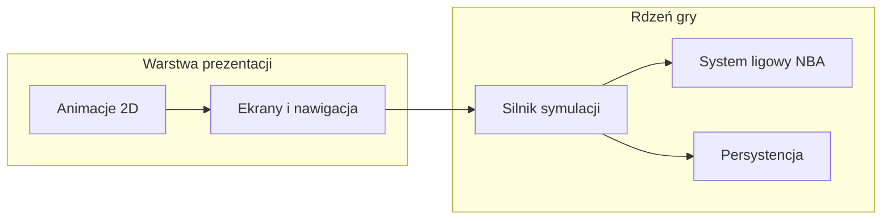

# Założenia projektowe

Dokument zbiera wszystkie istotne decyzje i założenia dotyczące gry mobilnej — menedżera piłkarskiego w stylu True Football Manager 3 z unowocześnioną oprawą i systemem ligowym inspirowanym NBA.

---

## 1. Wizja gry


| Aspekt           | Założenie                                                                                              |
| ---------------- | ------------------------------------------------------------------------------------------------------ |
| Gatunek          | Symulator zarządzania drużyną piłkarską (manager)                                                      |
| Inspiracja       | True Football Manager 3 — skupienie na menu, liczbach, decyzjach menedżerskich                         |
| Tryb gry         | Offline, singleplayer                                                                                  |
| Fokus            | Wyłącznie zarządzanie zespołem — bez animacji meczowych                                                |
| Poziom trudności | Wyższy niż w TFM3 — gra ma być wymagająca i karząca za złe decyzje                                     |
| Grafika          | 2D z prostymi animacjami (przejścia UI, karty zawodników, wykresy, ewentualnie ilustracje Rive/Lottie) |
| Platformy        | Android (pierwsza wersja), iOS (później, ten sam codebase)                                             |


---


## 2. System ligowy (styl NBA)

W odróżnieniu od klasycznego modelu piłkarskiego (wiele lig krajowych, awanse/spadki, pucharowe turnieje):


| Element         | Założenie                                                                            |
| --------------- | ------------------------------------------------------------------------------------ |
| Struktura       | Jedna większa liga (jedna „superliga” zamiast piramidy lig krajowych)                |
| Sezon regularny | Tabela ligowa, mecze symulowane w tle (bez wizualizacji)                             |
| Playoff         | System playoffów na końcu sezonu (faza pucharowa zamiast prostego mistrza z tabeli)  |
| Draft           | Nabór młodych zawodników — główny sposób pozyskiwania talentów                       |
| Salary cap      | Limit płacowy — ograniczenie budżetu na pensje, wymuszające trudne decyzje finansowe |
| Transfery       | Wymiany 2-drużynowe (zawodnicy + picki) — `trade_rules.md`; uzupełnienie draftu i FA |


---


## 3. Zakres funkcjonalny (wysoki poziom)

Gra to w praktyce **symulator z bogatym UI**, nie gra akcji:

- setki ekranów: skład, taktyka, draft, kontrakty, finanse, tabela, bracket playoffów
- złożona logika symulacji day-to-day (kolejne dni i mecze, decyzje menedżerskie, statystyki zawodników) — inbox i pauzy na ważne wiadomości: `docs/messages.md`
- zapis offline — potencjalnie setki MB danych po wielu sezonach kariery
- brak animacji meczowych — wynik i statystyki jako liczby/tekst

**Poza zakresem (na start):**

- multiplayer / online
- animacje meczów (2D lub 3D)
- wiele lig krajowych z awansami/spadkami

---


## 4. Zespół i harmonogram


| Aspekt            | Założenie                                                                             |
| ----------------- | ------------------------------------------------------------------------------------- |
| Zespół            | Jedna osoba (solo dev)                                                                |
| Czas              | Dużo czasu na rozwój — priorytetem jest jakość symulacji i balans, nie szybki release |
| Doświadczenie dev | Flutter, TypeScript/JavaScript, C++, Python — język nie jest ograniczeniem            |


---


## 5. Decyzja techniczna: Flutter

**Wybrany stack: Flutter + Dart**

### Dlaczego Flutter

- Najlepsze dopasowanie do gatunku — TFM3 to w ~90% menu, tabele i liczby
- Szybka iteracja (hot reload) przy strojeniu trudności, draftu i salary cap
- Jeden codebase na Android i iOS
- Lżejszy APK niż Unity (~15–30 MB vs często 80–150 MB)
- Łatwe unit testy silnika symulacji bez uruchamiania aplikacji
- Istniejące doświadczenie z Flutterem przyspiesza start


### Ograniczenia do zaakceptowania

- Framework aplikacji, nie silnik gry — brak edytora scen; animacje sprite'owe wymagają więcej ręcznej pracy
- Publikacja na iOS wymaga Maca (ograniczenie infrastrukturalne)
- Mniejsza społeczność „gier w Flutterze” niż w Unity — mniej gotowych assetów sportowych


### Rozważane i odrzucone alternatywy


| Opcja                   | Werdykt                                                                                       |
| ----------------------- | --------------------------------------------------------------------------------------------- |
| **Godot 4**             | Lepszy przy silnym „game feel” 2D, ale więcej pracy nad UI menedżerskim (tabele, draft board) |
| **Unity**               | Overkill bez animacji meczowych — duży APK, wolniejsza iteracja                               |
| **React Native**        | Słabszy w złożonych listach/tabelach niż Flutter                                              |
| **Kotlin/Compose**      | Dobry na Android, ale iOS = osobny projekt                                                    |
| **C++ / Python mobile** | Zbyt duży koszt infrastruktury dla solo deva                                                  |


---


## 6. Stack techniczny

```
Flutter 3.x (Dart 3)
├── riverpod                    — stan aplikacji i dependency injection
├── go_router                   — nawigacja
├── isar                        — baza offline (save + historia sezonów)
├── freezed + json_serializable — modele danych (immutable)
├── flutter_animate             — proste animacje UI (opcjonalnie)
└── rive lub lottie             — animowane ilustracje 2D (opcjonalnie)
```


| Warstwa         | Technologia                                             |
| --------------- | ------------------------------------------------------- |
| UI / app shell  | Flutter (Material 3 lub custom theme)                   |
| Animacje 2D     | Wbudowane animacje Flutter + opcjonalnie Rive/Lottie    |
| Stan aplikacji  | Riverpod                                                |
| Baza offline    | Isar (alternatywa: Drift/SQLite przy relacyjnym modelu) |
| Nawigacja       | go_router                                               |
| Testy symulacji | dart test (unit testy rdzenia bez UI)                   |


---


## 7. Architektura

Logika symulacji **musi być niezależna od Fluttera** — umożliwia testowanie balansu i trudności bez emulatora.

```
lib/
├── core/          # Silnik gry — BEZ importów Fluttera
│   ├── simulation/    # Symulacja meczu, day-to-day
│   ├── league/        # System ligowy, playoff
│   ├── draft/         # Draft zawodników
│   ├── finance/       # Salary cap, kontrakty
│   └── models/        # Modele domenowe
├── data/          # Persystencja (Isar, repozytoria)
└── app/           # UI Flutter
    ├── screens/
    ├── widgets/
    └── routing/
```




---


## 8. Kluczowe wymagania niefunkcjonalne

- **Offline-first** — gra w pełni grywalna bez internetu
- **Testowalność** — rdzeń symulacji pokryty unit testami
- **Wydajność list** — płynne przewijanie setek zawodników/wierszy tabeli
- **Rozmiar APK** — cel: lekka aplikacja mobilna, nie ciężki silnik gry
- **Utrzymywalność** — solo dev musi móc wracać do projektu po przerwach bez chaosu w kodzie

---


## 9. Status dokumentacji

Szczegóły reguł: `game_rules.md` i pliki tematyczne (`draft_rules`, `salary_cap_rules`, `tactics`, `squad_management`, `player_management`, `offseason`, `contract_signing`, `messages`, itd.).

Kod może chwilowo odstawać od docs (np. stare `fitness`, cap 150M, 2 rundy draftu) — **docs są źródłem prawdy projektowej**.

---

*Ostatnia aktualizacja: 2026-07-24*